# Structural DNA helical parameters from MD trajectory tutorial using BioExcel Building Blocks (biobb)
Based on the [**NAFlex**](https://mmb.irbbarcelona.org/NAFlex) server and in particular in its [**Nucleic Acids Analysis**](https://mmb.irbbarcelona.org/NAFlex/help.php?id=tutorialAnalysisNA) section. 

***
This tutorial aims to illustrate the process of **extracting structural and dynamical properties** from a **DNA MD trajectory helical parameters**, step by step, using the **BioExcel Building Blocks library (biobb)**. The particular example used is the **Drew Dickerson Dodecamer** sequence -CGCGAATTCGCG- (PDB code [1BNA](https://www.rcsb.org/structure/1BNA), [https://doi.org/10.2210/pdb1BNA/pdb](https://doi.org/10.2210/pdb1BNA/pdb)). The trajectory used is a  500ns-long MD simulation taken from the [BigNASim](https://mmb.irbbarcelona.org/BIGNASim/) database ([NAFlex_DDD_II](https://mmb.irbbarcelona.org/BIGNASim/getStruc.php?idCode=NAFlex_DDD_II) entry).  
***

## Settings

### Biobb modules used

 - [biobb_dna](https://github.com/bioexcel/biobb_dna): Tools to analyse DNA structures and MD trajectories.
 
### Auxiliary libraries used

* [jupyter](https://jupyter.org/): Free software, open standards, and web services for interactive computing across all programming languages.
* [matplotlib](https://matplotlib.org/): Comprehensive library for creating static, animated, and interactive visualizations in Python.

### Conda Installation & Launch

```console
git clone https://github.com/bioexcel/biobb_wf_dna_helparms.git
cd biobb_wf_dna_helparms
conda env create -f conda_env/environment.yml
conda activate biobb_dna_helparms_tutorial
jupyter-notebook biobb_wf_dna_helparms/notebooks/biobb_dna_helparms_tutorial.ipynb
```

***
## Pipeline steps
 1. [Input Parameters](#input)
 2. [Running Curves+ and Canal](#curves)
 3. [Average Helical Parameters](#averages)
     1. [Base Pair Step (Inter Base Pair) Parameters](#avg_bps)
     2. [Base Pair (Intra Base Pair) Parameters](#avg_bp)
     3. [Axis Parameters](#avg_axis)
     4. [Grooves](#avg_grooves)
     5. [Backbone Torsions](#avg_backbone)
 8. [Time Series Helical Parameters](#timeseries)
 8. [Stiffness](#stiffness)
 9. [Bimodality](#bimodality)
 10. [Correlations](#correlations)
     1. [Sequence Correlations: Intra-base pairs](#intraseqcorr)
     2. [Sequence Correlations: Inter-base pair steps](#interseqcorr)
     3. [Helical Parameter Correlations: Intra-base pairs](#intrahpcorr)
     4. [Helical Parameter Correlations: Inter-base pair steps](#interhpcorr)
     5. [Neighboring steps Correlations: Intra-base pairs](#intrabpcorr)
     6. [Neighboring steps Correlations: Inter-base pair steps](#interbpcorr)
 11. [Questions & Comments](#questions)
 
***

***


```python
# Auxiliary libraries

import os
import shutil
import glob
from pathlib import Path, PurePath
import zipfile
import matplotlib.image as mpimg
import matplotlib.pyplot as plt
import pandas as pd
from IPython.display import Image
import ipywidgets

```

<a id="input"></a>
## Input parameters
**Input parameters** needed:
 - **seq**: Sequence of the DNA structure (e.g. CGCGAATTCGCG)
 - **seq_comp**: Complementary sequence of the given DNA structure (e.g. CGCGAATTCGCG)
 
 - **traj**: Trajectory for a 500ns Drew Dickerson Dodecamer MD simulation (taken from [BigNASim](https://mmb.irbbarcelona.org/BIGNASim/)) 
 - **top**: Associated topology for the MD trajectory 


```python
# Input parameters
seq = "CGCGAATTCGCG"
seq_comp = "CGCGAATTCGCG"

traj = "TRAJ/structure.stripped.nc"
top = "TRAJ/structure.stripped.top"

# Auxiliary lists
grooves = ('majd','majw','mind','minw')
axis_base_pairs = ('inclin','tip','xdisp','ydisp')
base_pair = ('shear','stretch','stagger','buckle','propel','opening')
base_pair_step = ('rise','roll','twist','shift','slide','tilt')
backbone_torsions = ('alphaC', 'alphaW', 'betaC', 'betaW', 'gammaC', 'gammaW', 'deltaC', 'deltaW', \
'epsilC', 'epsilW', 'zetaC', 'zetaW', 'chiC', 'chiW', 'phaseC', 'phaseW')
```

<a id="curves"></a>
## Running Curves+ and Canal

***
**Curves+** program and its associated **Canal** tool allow us to extract **helical parameters** from a **DNA MD simulation**.

**Curves+** is a **nucleic acid conformational analysis program** which provides both **helical** and **backbone parameters**, including a curvilinear axis and parameters relating the position of the bases to this axis. It additionally provides a full analysis of **groove widths** and **depths**. **Curves+** can also be used to analyse **molecular dynamics trajectories**. With the help of the accompanying program **Canal**, it is possible to produce a variety of graphical output including parameter variations along a given structure and **time series** or **histograms** of parameter variations during dynamics.

**Conformational analysis of nucleic acids revisited: Curves+**<br>
*R. Lavery, M. Moakher, J. H. Maddocks, D. Petkeviciute, K. Zakrzewska*<br>
***Nucleic Acids Research, Volume 37, Issue 17, 1 September 2009, Pages 5917–5929***<br>
[https://doi.org/10.1093/nar/gkp608](https://doi.org/10.1093/nar/gkp608)


**CURVES+ web server for analyzing and visualizing the helical, backbone and groove parameters of nucleic acid structure.**<br>
*C. Blanchet, M. Pasi, K. Zakrzewska, R. Lavery*<br>
***Nucleic Acids Research, Volume 39, Issue suppl_2, 1 July 2011, Pages W68–W73***<br>
https://doi.org/10.1093/nar/gkr316
http://curvesplus.bsc.es

***
**Building Blocks** used:
- [curves](https://biobb-dna.readthedocs.io/en/latest/curvesplus.html#module-curvesplus.biobb_curves) from **biobb_dna.curvesplus.biobb_curves**
- [canal](https://biobb-dna.readthedocs.io/en/latest/curvesplus.html#module-curvesplus.biobb_canal) from **biobb_dna.curvesplus.biobb_canal**
***
The extraction of **helical parameters** is then done in **two steps**:

- [Step 1: Curves+](#curves1): Reading input **MD trajectory** and analysing **helical parameters**.
- [Step 2: Canal](#canal2): Taking **Curves+** output and generating **time series** and/or **histograms** of parameter variations during dynamics.

***

<a id="curves1"></a>
### Step 1: Curves+

**Curves+** program needs a **trajectory** and its associated **topology**, and a couple of **ranges**, informing about the numeration of the two **DNA strands**: s1range and s2range.

<div style="margin:10px 0;padding:15px;background:#b5e0dd"><strong>Important:</strong> Depending on the operating system used, the cell below can return an error about a missing <strong>.curvesplus</strong> folder. In this case, please copy the <strong>.curvesplus</strong> folder provided in the <strong>repository</strong> and copy it into the <strong>/path/to/anaconda3/envs/biobb_dna_helparms_tutorial</strong> folder in your computer.</div>


```python
from biobb_dna.curvesplus.biobb_curves import biobb_curves

curves_out_lis = "curves.out.lis"
curves_out_cda = "curves.out.cda"

prop = {
    's1range' : '1:12',
    's2range' : '24:13'
}

biobb_curves(
    input_struc_path=traj,
    input_top_path=top,
    output_lis_path=curves_out_lis,
    output_cda_path=curves_out_cda,
    properties=prop
)
```

<a id="canal2"></a>
### Step 2: Canal

**Canal** program needs the output of the previous **Curves+** execution, and is able to produce **time series** (series property) and **histograms** (histo property) for the **parameter variations** during dynamics.


```python
from biobb_dna.curvesplus.biobb_canal import biobb_canal

canal_out = "canal.out.zip"

prop = {
    'series' : True,
    'histo' : True
}

biobb_canal(
    input_cda_file=curves_out_cda,
    input_lis_file=curves_out_lis,
    output_zip_path=canal_out,
    properties=prop
)
```

### Extracting Canal results in a temporary folder


```python
canal_dir = "canal_out"

if Path(canal_dir).exists(): shutil.rmtree(canal_dir) 
os.mkdir(canal_dir)

with zipfile.ZipFile(canal_out, 'r') as zip_ref:
    zip_ref.extractall(canal_dir)
```

<a id="averages"></a>

## Extracting Average Helical Parameters

**Average helical parameter** values can be computed from the output of **Curves+/Canal** execution. 

The **helical parameters** can be divided in 5 main blocks:

- [Helical Base Pair Step (Inter-Base Pair) Helical Parameters](#avg_bps)
- [Helical Base Pair (Intra-Base Pair) Helical Parameters](#avg_bp)
- [Axis Base Pair](#avg_axis)
- [Grooves](#avg_grooves)
- [Backbone Torsions](#avg_backbone)


<a id="avg_bps"></a>

### Helical Base Pair Step (Inter Base Pair) Parameters

**Translational (Shift, Slide, Rise)** and **rotational (Tilt, Roll, Twist)** parameters related to a **dinucleotide Inter-Base Pair** (Base Pair Step).

- **Shift**: Translation around the X-axis.
- **Slide**: Translation around the Y-axis.
- **Rise**: Translation around the Z-axis.
- **Tilt**: Rotation around the X-axis.
- **Roll**: Rotation around the Y-axis.
- **Twist**: Rotation around the Z-axis.

***

***
**Building Block** used:
- [dna_averages](https://biobb-dna.readthedocs.io/en/latest/dna.html#module-dna.dna_averages) from **biobb_dna.dna.dna_averages** 
***

#### Extracting a particular Helical Parameter: Rise


```python
from biobb_dna.dna.dna_averages import dna_averages

helpar = 'rise'

input_file_path = "canal_out/canal_output" + "_" + helpar + ".ser"
output_averages_csv_path= helpar+'.averages.csv'
output_averages_jpg_path= helpar+'.averages.jpg'

prop = {
    'helpar_name': helpar,
    'sequence': seq
}

dna_averages(
    input_ser_path=input_file_path,
    output_csv_path=output_averages_csv_path,
    output_jpg_path=output_averages_jpg_path,
    properties=prop)
```

#### Showing the calculated average values for Rise helical parameter


```python
output_averages_csv_path= helpar+'.averages.csv'
df = pd.read_csv(output_averages_csv_path)
df
```


<div>
<style scoped>
    .dataframe tbody tr th:only-of-type {
        vertical-align: middle;
    }

    .dataframe tbody tr th {
        vertical-align: top;
    }

    .dataframe thead th {
        text-align: right;
    }
</style>
<table border="1" class="dataframe">
  <thead>
    <tr style="text-align: right;">
      <th></th>
      <th>Base Pair Step</th>
      <th>mean</th>
      <th>std</th>
    </tr>
  </thead>
  <tbody>
    <tr>
      <th>0</th>
      <td>GC</td>
      <td>3.470550</td>
      <td>0.377972</td>
    </tr>
    <tr>
      <th>1</th>
      <td>CG</td>
      <td>2.978038</td>
      <td>0.454661</td>
    </tr>
    <tr>
      <th>2</th>
      <td>GA</td>
      <td>3.377096</td>
      <td>0.408705</td>
    </tr>
    <tr>
      <th>3</th>
      <td>AA</td>
      <td>3.363942</td>
      <td>0.378155</td>
    </tr>
    <tr>
      <th>4</th>
      <td>AT</td>
      <td>3.444138</td>
      <td>0.355242</td>
    </tr>
    <tr>
      <th>5</th>
      <td>TT</td>
      <td>3.374110</td>
      <td>0.376290</td>
    </tr>
    <tr>
      <th>6</th>
      <td>TC</td>
      <td>3.370114</td>
      <td>0.411934</td>
    </tr>
    <tr>
      <th>7</th>
      <td>CG</td>
      <td>2.982740</td>
      <td>0.454215</td>
    </tr>
    <tr>
      <th>8</th>
      <td>GC</td>
      <td>3.464096</td>
      <td>0.390428</td>
    </tr>
  </tbody>
</table>
</div>


#### Plotting the average values for Rise helical parameter 


```python
Image(filename=output_averages_jpg_path,width = 600)
```


    
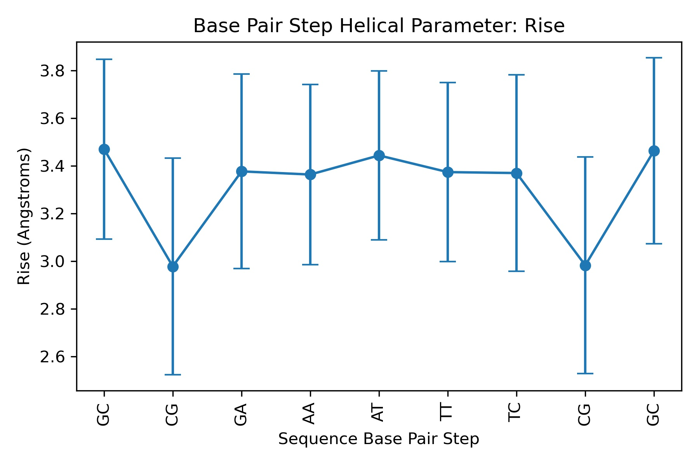
    


#### Computing average values from all base-pair step parameters


```python
from biobb_dna.dna.dna_averages import dna_averages

for helpar in base_pair_step:

    input_file_path = "canal_out/canal_output" + "_" + helpar + ".ser"
    output_averages_csv_path= helpar+'.averages.csv'
    output_averages_jpg_path= helpar+'.averages.jpg'

    prop = {
        'helpar_name': helpar,
        'sequence': seq
    }

    dna_averages(
        input_ser_path=input_file_path,
        output_csv_path=output_averages_csv_path,
        output_jpg_path=output_averages_jpg_path,
        properties=prop)
```

#### Showing the calculated average values for all base-pair step helical parameters


```python
for helpar in base_pair_step:
    output_averages_csv_path= helpar+'.averages.csv'
    df = pd.read_csv(output_averages_csv_path)
    print("Helical Parameter: " + helpar)
    print(df)
    print("---------\n")
```

    Helical Parameter: rise
      Base Pair Step      mean       std
    0             GC  3.470550  0.377972
    1             CG  2.978038  0.454661
    2             GA  3.377096  0.408705
    3             AA  3.363942  0.378155
    4             AT  3.444138  0.355242
    5             TT  3.374110  0.376290
    6             TC  3.370114  0.411934
    7             CG  2.982740  0.454215
    8             GC  3.464096  0.390428
    ---------
    
    Helical Parameter: roll
      Base Pair Step      mean       std
    0             GC -4.192414  8.331507
    1             CG  9.446606  9.363419
    2             GA  1.852456  8.644153
    3             AA  0.536582  7.624018
    4             AT -3.163010  7.237972
    5             TT  0.534468  7.656334
    6             TC  2.127450  8.682155
    7             CG  9.585186  9.365877
    8             GC -4.021720  8.647046
    ---------
    
    Helical Parameter: twist
      Base Pair Step       mean       std
    0             GC  34.088546  4.816438
    1             CG  32.326028  6.989191
    2             GA  35.500510  5.637390
    3             AA  35.972860  4.838027
    4             AT  32.721506  3.618198
    5             TT  36.053014  4.974014
    6             TC  35.610722  5.545855
    7             CG  32.319386  6.922376
    8             GC  34.228190  4.863295
    ---------
    
    Helical Parameter: shift
      Base Pair Step      mean       std
    0             GC  0.269898  1.002226
    1             CG  0.261994  1.120109
    2             GA -0.568252  0.924852
    3             AA -0.303916  0.701930
    4             AT  0.003008  0.560834
    5             TT  0.320328  0.700562
    6             TC  0.573412  0.934916
    7             CG -0.315024  1.130856
    8             GC -0.220348  0.982379
    ---------
    
    Helical Parameter: slide
      Base Pair Step      mean       std
    0             GC -0.207536  0.492641
    1             CG  0.121372  0.560931
    2             GA -0.023312  0.648352
    3             AA -0.502846  0.563088
    4             AT -0.963374  0.396783
    5             TT -0.510682  0.556494
    6             TC -0.011398  0.648248
    7             CG  0.135720  0.561489
    8             GC -0.242346  0.509866
    ---------
    
    Helical Parameter: tilt
      Base Pair Step      mean       std
    0             GC  0.788582  5.737113
    1             CG  2.352174  6.790473
    2             GA -2.433898  5.987960
    3             AA -2.723502  5.435644
    4             AT  0.072902  4.969859
    5             TT  2.780530  5.351470
    6             TC  2.466076  5.965965
    7             CG -2.520270  6.909690
    8             GC -0.519486  5.749269
    ---------
    


#### Plotting the average values for all base-pair step helical parameters 


```python
images = []
for helpar in base_pair_step:
    images.append(helpar + '.averages.jpg')

f, axarr = plt.subplots(2, 3, figsize=(40, 20))

for i, image in enumerate(images):
    y = i%3
    x = int(i/3)

    img = mpimg.imread(image)

    axarr[x,y].imshow(img, aspect='auto')
    axarr[x,y].axis('off')

plt.show()

```


    
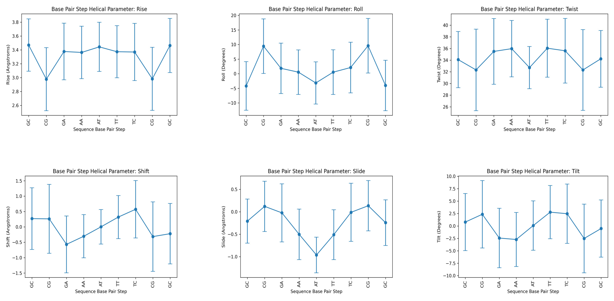
    


<a id="avg_bp"></a>
### Helical Base Pair (Intra Base Pair) Parameters

**Translational (Shear, Stretch, Stagger)** and **rotational (Buckle, Propeller, Opening)** parameters related to a **dinucleotide Intra-Base Pair**.

- **Shear**: Translation around the X-axis.
- **Stretch**: Translation around the Y-axis.
- **Stagger**: Translation around the Z-axis.
- **Buckle**: Rotation around the X-axis.
- **Propeller**: Rotation around the Y-axis.
- **Opening**: Rotation around the Z-axis.

***

***
**Building Block** used:
- [dna_averages](https://biobb-dna.readthedocs.io/en/latest/dna.html#module-dna.dna_averages) from **biobb_dna.dna.dna_averages** 
***

#### Computing average values from all base-pair parameters


```python
from biobb_dna.dna.dna_averages import dna_averages

for helpar in base_pair:

    #input_file_path = canal_out + "_" + helpar + ".ser"
    input_file_path = "canal_out/canal_output" + "_" + helpar + ".ser"
    output_averages_csv_path= helpar+'.averages.csv'
    output_averages_jpg_path= helpar+'.averages.jpg'

    prop = {
        'helpar_name': helpar,
        'sequence': seq
    }

    dna_averages(
        input_ser_path=input_file_path,
        output_csv_path=output_averages_csv_path,
        output_jpg_path=output_averages_jpg_path,
        properties=prop)
```

#### Showing the calculated average values for all base-pair helical parameters


```python
for helpar in base_pair:
    output_averages_csv_path= helpar+'.averages.csv'
    df = pd.read_csv(output_averages_csv_path)
    print("Helical Parameter: " + helpar)
    print(df)
    print("---------\n")
```

    Helical Parameter: shear
      Base Pair       mean       std
    0          G -0.049992  0.437419
    1          C -0.066120  0.428450
    2          G  0.033414  0.438027
    3          A  0.192408  0.393915
    4          A  0.181268  0.382112
    5          T -0.187710  0.394140
    6          T -0.209416  0.391508
    7          C -0.021976  0.444251
    8          G  0.061500  0.432066
    9          C  0.033314  0.430674
    ---------
    
    Helical Parameter: stretch
      Base Pair       mean       std
    0          G  0.021910  0.154373
    1          C  0.057128  0.146271
    2          G  0.089684  0.162121
    3          A  0.073182  0.155722
    4          A  0.043370  0.154155
    5          T  0.046586  0.151565
    6          T  0.072776  0.159554
    7          C  0.088406  0.164430
    8          G  0.060682  0.149506
    9          C  0.026160  0.148136
    ---------
    
    Helical Parameter: stagger
      Base Pair       mean       std
    0          G  0.270900  0.531987
    1          C  0.190716  0.524902
    2          G -0.030574  0.514709
    3          A  0.094458  0.515384
    4          A  0.123512  0.511518
    5          T  0.111454  0.501179
    6          T  0.094714  0.513247
    7          C -0.052344  0.516656
    8          G  0.187962  0.520935
    9          C  0.245116  0.527218
    ---------
    
    Helical Parameter: buckle
      Base Pair       mean        std
    0          G -2.011124  10.957743
    1          C -2.108248  10.706547
    2          G  7.351526  11.411534
    3          A  6.094836  11.016860
    4          A  2.021262   9.824963
    5          T -1.932570   9.869768
    6          T -6.454566  10.888373
    7          C -7.332888  11.269869
    8          G  1.551400  10.722523
    9          C  1.740906  10.696502
    ---------
    
    Helical Parameter: propel
      Base Pair        mean        std
    0          G  -8.589338  13.487527
    1          C  -3.200962  12.673929
    2          G  -4.877606  12.107475
    3          A -15.895916  11.463353
    4          A -17.740540  11.053182
    5          T -17.600944  10.901201
    6          T -15.934650  11.522282
    7          C  -3.809752  12.151864
    8          G  -3.145238  12.632066
    9          C  -8.300600  13.082747
    ---------
    
    Helical Parameter: opening
      Base Pair       mean       std
    0          G  0.519980  4.990688
    1          C  0.727574  4.801118
    2          G  2.788520  5.011118
    3          A  2.696966  6.306307
    4          A  2.434002  5.929345
    5          T  2.367904  5.751322
    6          T  2.837478  6.282682
    7          C  2.813492  5.139189
    8          G  0.822494  4.850359
    9          C  0.483850  4.838646
    ---------
    


#### Plotting the average values for all base-pair helical parameters 


```python
images = []
for helpar in base_pair:
    images.append(helpar + '.averages.jpg')

f, axarr = plt.subplots(2, 3, figsize=(40, 20))

for i, image in enumerate(images):
    y = i%3
    x = int(i/3)

    img = mpimg.imread(image)

    axarr[x,y].imshow(img, aspect='auto')
    axarr[x,y].axis('off')

plt.show()
```


    
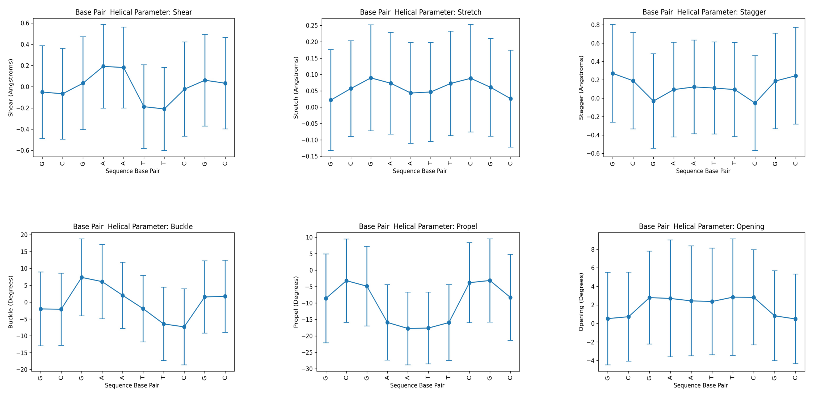
    


<a id="avg_axis"></a>
### Axis Base Pair Parameters

***
**Translational (x/y-displacement)** and **rotational (inclination, tip)** parameters related to a dinucleotide Base Pair.

- **X-displacement**: Translation around the X-axis.
- **Y-displacement**: Translation around the Y-axis.
- **Inclination**: Rotation around the X-axis.
- **Tip**: Rotation around the Y-axis.
***

***
**Building Block** used:
- [dna_averages](https://biobb-dna.readthedocs.io/en/latest/dna.html#module-dna.dna_averages) from **biobb_dna.dna.averages** 
***

#### Computing average values from all Axis base-pair parameters


```python
from biobb_dna.dna.dna_averages import dna_averages

for helpar in axis_base_pairs:

    #input_file_path = canal_out + "_" + helpar + ".ser"
    input_file_path = "canal_out/canal_output" + "_" + helpar + ".ser"
    output_averages_csv_path= helpar+'.averages.csv'
    output_averages_jpg_path= helpar+'.averages.jpg'

    prop = {
        'helpar_name': helpar,
        'sequence': seq,
#        'seqpos': [4,3]
    }

    dna_averages(
        input_ser_path=input_file_path,
        output_csv_path=output_averages_csv_path,
        output_jpg_path=output_averages_jpg_path,
        properties=prop)
```

#### Showing the calculated average values for all Axis base-pair helical parameters


```python
for helpar in axis_base_pairs:
    output_averages_csv_path= helpar+'.averages.csv'
    df = pd.read_csv(output_averages_csv_path)
    print("Helical Parameter: " + helpar)
    print(df)
    print("---------\n")
```

    Helical Parameter: inclin
      Base Pair       mean       std
    0          G  6.041284  6.230831
    1          C  5.410818  5.944490
    2          G  5.825528  5.359376
    3          A  2.924440  5.031021
    4          A  0.346356  4.709278
    5          T  0.460490  4.744693
    6          T  3.120780  5.069334
    7          C  6.106598  5.504673
    8          G  5.647446  6.043921
    9          C  6.601924  6.358550
    ---------
    
    Helical Parameter: tip
      Base Pair       mean        std
    0          G  2.512608   5.728359
    1          C -5.681794   6.177066
    2          G  0.907828   6.084601
    3          A  0.569286   5.347552
    4          A  1.306582   4.845978
    5          T -1.227768   5.019692
    6          T -0.568284   5.338846
    7          C -0.767708   6.048420
    8          G  5.821194   6.102313
    9          C -2.578986  10.627202
    ---------
    
    Helical Parameter: xdisp
      Base Pair       mean       std
    0          G -0.659664  0.857688
    1          C -0.487874  0.832502
    2          G -0.421234  0.867164
    3          A -0.937412  0.731117
    4          A -1.150654  0.600304
    5          T -1.149698  0.604352
    6          T -0.933022  0.736415
    7          C -0.428964  0.875973
    8          G -0.560260  0.827803
    9          C -0.704972  0.883845
    ---------
    
    Helical Parameter: ydisp
      Base Pair       mean       std
    0          G  0.031522  0.563973
    1          C -0.185588  0.531173
    2          G -0.029302  0.526326
    3          A  0.089948  0.507185
    4          A  0.132712  0.462237
    5          T -0.133432  0.454954
    6          T -0.113044  0.506105
    7          C  0.002278  0.526475
    8          G  0.176116  0.529698
    9          C -0.071754  0.554503
    ---------
    


#### Plotting the average values for all Axis base-pair helical parameters 


```python
images = []
for helpar in axis_base_pairs:
    images.append(helpar + '.averages.jpg')

f, axarr = plt.subplots(2, 2, figsize=(30, 20))

for i, image in enumerate(images):
    y = i%2
    x = int(i/2)

    img = mpimg.imread(image)

    axarr[x,y].imshow(img, aspect='auto')
    axarr[x,y].axis('off')

plt.show()
```


    
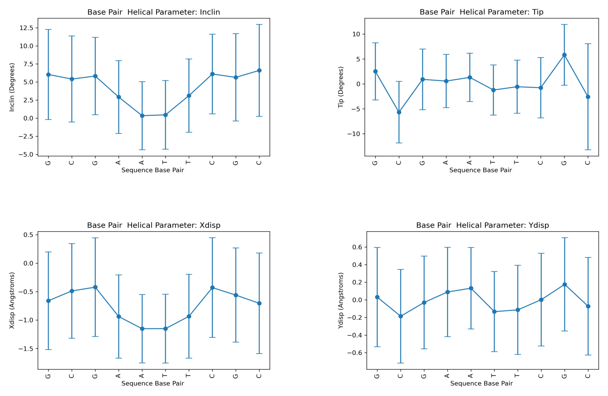
    


<a id="avg_grooves"></a>
### Grooves

***
Nucleic Acid Structure's strand backbones appear closer together on one side of the helix than on the other. This creates a **Major groove** (where backbones are far apart) and a **Minor groove** (where backbones are close together). **Depth and width** of these grooves can be mesured giving information about the different conformations that the nucleic acid structure can achieve.

- **Major Groove Width**.
- **Major Groove Depth**.
- **Minor Groove Width**.
- **Minor Groove Depth**.

***

***
**Building Block** used:
- [dna_averages](https://biobb-dna.readthedocs.io/en/latest/dna.html#module-dna.dna_averages) from **biobb_dna.dna.dna_averages**
***

#### Computing average values from all Grooves parameters


```python
from biobb_dna.dna.dna_averages import dna_averages

for helpar in grooves:

    #input_file_path = canal_out + "_" + helpar + ".ser"
    input_file_path = "canal_out/canal_output" + "_" + helpar + ".ser"
    output_averages_csv_path= helpar+'.averages.csv'
    output_averages_jpg_path= helpar+'.averages.jpg'

    prop = {
        'helpar_name': helpar,
        'sequence': seq
    }

    dna_averages(
        input_ser_path=input_file_path,
        output_csv_path=output_averages_csv_path,
        output_jpg_path=output_averages_jpg_path,
        properties=prop)
```

#### Showing the calculated average values for all Grooves parameters


```python
for helpar in grooves:
    output_averages_csv_path= helpar+'.averages.csv'
    df = pd.read_csv(output_averages_csv_path)
    print("Helical Parameter: " + helpar)
    print(df)
    print("---------\n")
```

    Helical Parameter: majd
      Base Pair Step      mean       std
    0             GC       NaN       NaN
    1             CG -0.703077  1.362241
    2             GA  3.396398  1.402178
    3             AA  5.710123  1.406443
    4             AT  5.156143  1.346752
    5             TT  5.139702  1.337523
    6             TC  5.735556  1.447770
    7             CG  3.371511  1.402279
    8             GC -0.644086  1.444480
    ---------
    
    Helical Parameter: majw
      Base Pair Step       mean       std
    0             GC        NaN       NaN
    1             CG  13.040615  1.300370
    2             GA  12.664800  1.419105
    3             AA  11.986143  1.670021
    4             AT  11.476450  1.797558
    5             TT  11.472435  1.740485
    6             TC  11.964836  1.648435
    7             CG  12.508447  1.419017
    8             GC  12.819785  1.347786
    ---------
    
    Helical Parameter: mind
      Base Pair Step      mean       std
    0             GC       NaN       NaN
    1             CG  3.932224  1.148757
    2             GA  5.100660  1.114656
    3             AA  4.926210  0.677415
    4             AT  4.968002  0.453657
    5             TT  4.966188  0.452291
    6             TC  4.912856  0.690885
    7             CG  5.121034  1.132328
    8             GC  3.969312  1.021299
    ---------
    
    Helical Parameter: minw
      Base Pair Step      mean       std
    0             GC       NaN       NaN
    1             CG  7.713347  1.175525
    2             GA  6.789962  1.405118
    3             AA  5.296306  1.332686
    4             AT  4.160776  1.113765
    5             TT  4.109198  1.119448
    6             TC  5.376128  1.314328
    7             CG  6.827374  1.402630
    8             GC  7.729192  1.148585
    ---------
    


#### Plotting the average values for all Grooves helical parameters 


```python
images = []
for helpar in grooves:
    images.append(helpar + '.averages.jpg')

f, axarr = plt.subplots(2, 2, figsize=(30, 20))

for i, image in enumerate(images):
    y = i%2
    x = int(i/2)

    img = mpimg.imread(image)

    axarr[x,y].imshow(img, aspect='auto')
    axarr[x,y].axis('off')

plt.show()
```


    
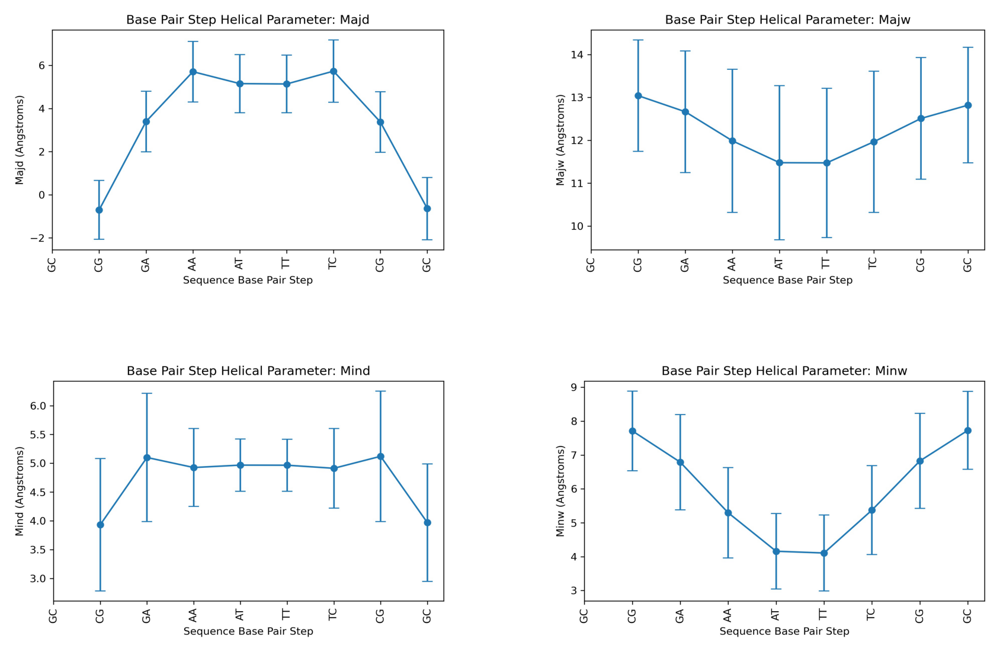
    


<a id="avg_backbone"></a>
### Backbone Torsions

***

 The three major elements of flexibility in the **backbone** are:

- **[Sugar Puckering](#puckering)**:

    Sugar Puckering annotation is done by dividing the pseudo-rotational circle in four equivalent sections:<br><br>
    - ***North***: 315:45º
    - ***East***: 45:135º
    - ***South***: 135:225º
    - ***West***: 225:315º
    
 These four conformations are those dominating sugar conformational space, in agreement with all available experimental data.


- **[Canonical Alpha/Gamma](#alphagamma)**:

    Rotations around **α/γ torsions** generate non-canonical local conformations leading to a reduced twist and they have been reported as being important in the formation of several protein-DNA complexes. 
    
    
- **[BI/BII Population](#bIbII)**:

    The concerted rotation around **ζ/ε torsions** generates two major conformers: **BI and BII**, which are experimentally known to co-exist in a ratio around 80%:20% (BI:BII) in B-DNA.


<table><tr style="background-color: #FFFFFF"><td>
     
</td><td>
    
</td><td>
    
</td></tr>
<tr ><td>
    <p style="text-align: center; font-weight: bold">Sugar Puckering</p>
</td>
<td>
    <p style="text-align: center; font-weight: bold">Canonical Alpha/Gamma</p>
</td>
<td>
    <p style="text-align: center; font-weight: bold">BI/BII population</p>
</td></tr>
</table>
    
***
**Building Blocks** used:
- [puckering](https://biobb-dna.readthedocs.io/en/latest/backbone.html#module-backbone.puckering) from **biobb_dna.backbone.puckering** 
- [canonicalag](https://biobb-dna.readthedocs.io/en/latest/backbone.html#module-backbone.canonicalag) from **biobb_dna.backbone.canonicalag**
- [bipopulations](https://biobb-dna.readthedocs.io/en/latest/backbone.html#module-backbone.bipopulations) from **biobb_dna.backbone.bipopulations**
***

<a id="puckering"></a>

#### Sugar Puckering

##### Computing average values


```python
from biobb_dna.backbone.puckering import puckering

canal_phaseC = "canal_out/canal_output_phaseC.ser"
canal_phaseW = "canal_out/canal_output_phaseW.ser"

output_puckering_csv_path = 'puckering.averages.csv'
output_puckering_jpg_path = 'puckering.averages.jpg'

prop = {
    'sequence': seq
}

puckering(
    input_phaseC_path=canal_phaseC,
    input_phaseW_path=canal_phaseW,
    output_csv_path=output_puckering_csv_path,
    output_jpg_path=output_puckering_jpg_path,
    properties=prop)
```

##### Showing the calculated average values


```python
df = pd.read_csv(output_puckering_csv_path)
df
```


<div>
<style scoped>
    .dataframe tbody tr th:only-of-type {
        vertical-align: middle;
    }

    .dataframe tbody tr th {
        vertical-align: top;
    }

    .dataframe thead th {
        text-align: right;
    }
</style>
<table border="1" class="dataframe">
  <thead>
    <tr style="text-align: right;">
      <th></th>
      <th>Nucleotide</th>
      <th>North</th>
      <th>East</th>
      <th>West</th>
      <th>South</th>
    </tr>
  </thead>
  <tbody>
    <tr>
      <th>0</th>
      <td>C5'-1</td>
      <td>1.82</td>
      <td>8.84</td>
      <td>0.02</td>
      <td>89.32</td>
    </tr>
    <tr>
      <th>1</th>
      <td>G-2</td>
      <td>0.10</td>
      <td>5.92</td>
      <td>0.02</td>
      <td>93.96</td>
    </tr>
    <tr>
      <th>2</th>
      <td>C-3</td>
      <td>3.36</td>
      <td>20.02</td>
      <td>0.00</td>
      <td>76.60</td>
    </tr>
    <tr>
      <th>3</th>
      <td>G-4</td>
      <td>0.76</td>
      <td>7.52</td>
      <td>0.00</td>
      <td>91.72</td>
    </tr>
    <tr>
      <th>4</th>
      <td>A-5</td>
      <td>4.16</td>
      <td>6.72</td>
      <td>0.00</td>
      <td>89.10</td>
    </tr>
    <tr>
      <th>5</th>
      <td>A-6</td>
      <td>3.04</td>
      <td>16.44</td>
      <td>0.00</td>
      <td>80.50</td>
    </tr>
    <tr>
      <th>6</th>
      <td>T-7</td>
      <td>1.16</td>
      <td>34.06</td>
      <td>0.00</td>
      <td>64.76</td>
    </tr>
    <tr>
      <th>7</th>
      <td>T-8</td>
      <td>1.50</td>
      <td>30.36</td>
      <td>0.00</td>
      <td>68.10</td>
    </tr>
    <tr>
      <th>8</th>
      <td>C-9</td>
      <td>4.00</td>
      <td>24.56</td>
      <td>0.00</td>
      <td>71.44</td>
    </tr>
    <tr>
      <th>9</th>
      <td>G-10</td>
      <td>0.60</td>
      <td>6.40</td>
      <td>0.02</td>
      <td>92.98</td>
    </tr>
    <tr>
      <th>10</th>
      <td>C-11</td>
      <td>1.72</td>
      <td>13.38</td>
      <td>0.00</td>
      <td>84.90</td>
    </tr>
    <tr>
      <th>11</th>
      <td>G3'-12</td>
      <td>1.18</td>
      <td>17.28</td>
      <td>0.04</td>
      <td>81.50</td>
    </tr>
    <tr>
      <th>12</th>
      <td>-</td>
      <td>0.00</td>
      <td>0.00</td>
      <td>0.00</td>
      <td>0.00</td>
    </tr>
    <tr>
      <th>13</th>
      <td>G5'-12</td>
      <td>3.44</td>
      <td>12.72</td>
      <td>0.02</td>
      <td>83.80</td>
    </tr>
    <tr>
      <th>14</th>
      <td>C-11</td>
      <td>0.16</td>
      <td>5.56</td>
      <td>0.00</td>
      <td>94.24</td>
    </tr>
    <tr>
      <th>15</th>
      <td>G-10</td>
      <td>3.14</td>
      <td>20.70</td>
      <td>0.00</td>
      <td>76.14</td>
    </tr>
    <tr>
      <th>16</th>
      <td>C-9</td>
      <td>0.70</td>
      <td>7.32</td>
      <td>0.00</td>
      <td>91.98</td>
    </tr>
    <tr>
      <th>17</th>
      <td>T-8</td>
      <td>3.64</td>
      <td>7.04</td>
      <td>0.00</td>
      <td>89.32</td>
    </tr>
    <tr>
      <th>18</th>
      <td>T-7</td>
      <td>3.02</td>
      <td>14.58</td>
      <td>0.02</td>
      <td>82.38</td>
    </tr>
    <tr>
      <th>19</th>
      <td>A-6</td>
      <td>0.96</td>
      <td>33.82</td>
      <td>0.00</td>
      <td>65.22</td>
    </tr>
    <tr>
      <th>20</th>
      <td>A-5</td>
      <td>1.00</td>
      <td>28.42</td>
      <td>0.00</td>
      <td>70.58</td>
    </tr>
    <tr>
      <th>21</th>
      <td>G-4</td>
      <td>4.00</td>
      <td>23.96</td>
      <td>0.02</td>
      <td>71.98</td>
    </tr>
    <tr>
      <th>22</th>
      <td>C-3</td>
      <td>0.24</td>
      <td>7.14</td>
      <td>0.02</td>
      <td>92.60</td>
    </tr>
    <tr>
      <th>23</th>
      <td>G-2</td>
      <td>1.72</td>
      <td>12.86</td>
      <td>0.00</td>
      <td>85.40</td>
    </tr>
    <tr>
      <th>24</th>
      <td>C3'-1</td>
      <td>1.40</td>
      <td>16.46</td>
      <td>0.00</td>
      <td>82.12</td>
    </tr>
  </tbody>
</table>
</div>


##### Plotting the average values 


```python
Image(filename=output_puckering_jpg_path,width = 600)
```


    
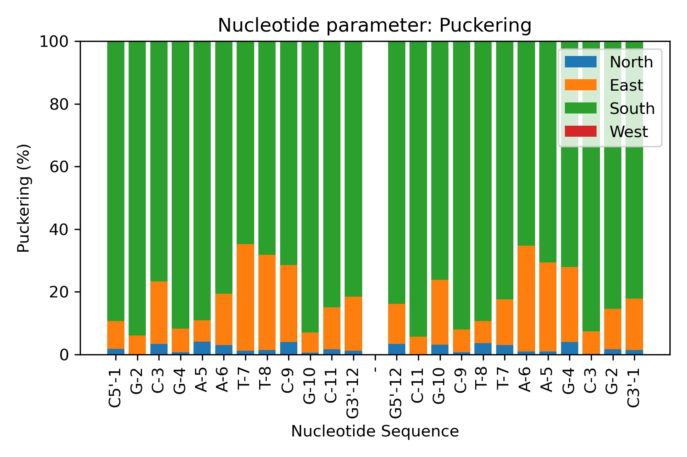
    


<a id="alphagamma"></a>
#### Canonical Alpha/Gamma

##### Computing average values


```python
from biobb_dna.backbone.canonicalag import canonicalag

canal_alphaC = "canal_out/canal_output_alphaC.ser"
canal_alphaW = "canal_out/canal_output_alphaW.ser"
canal_gammaC = "canal_out/canal_output_gammaC.ser"
canal_gammaW = "canal_out/canal_output_gammaW.ser"

output_alphagamma_csv_path = 'alphagamma.averages.csv'
output_alphagamma_jpg_path = 'alphagamma.averages.jpg'

prop = {
    'sequence': seq
}

canonicalag(
    input_alphaC_path=canal_alphaC,
    input_alphaW_path=canal_alphaW,
    input_gammaC_path=canal_gammaC,
    input_gammaW_path=canal_gammaW,
    output_csv_path=output_alphagamma_csv_path,
    output_jpg_path=output_alphagamma_jpg_path,
    properties=prop)
```

##### Showing the calculated average values


```python
df = pd.read_csv(output_alphagamma_csv_path)
df
```


<div>
<style scoped>
    .dataframe tbody tr th:only-of-type {
        vertical-align: middle;
    }

    .dataframe tbody tr th {
        vertical-align: top;
    }

    .dataframe thead th {
        text-align: right;
    }
</style>
<table border="1" class="dataframe">
  <thead>
    <tr style="text-align: right;">
      <th></th>
      <th>Nucleotide</th>
      <th>Canonical alpha/gamma</th>
    </tr>
  </thead>
  <tbody>
    <tr>
      <th>0</th>
      <td>C5'-1</td>
      <td>0.00</td>
    </tr>
    <tr>
      <th>1</th>
      <td>G-2</td>
      <td>96.76</td>
    </tr>
    <tr>
      <th>2</th>
      <td>C-3</td>
      <td>89.66</td>
    </tr>
    <tr>
      <th>3</th>
      <td>G-4</td>
      <td>92.70</td>
    </tr>
    <tr>
      <th>4</th>
      <td>A-5</td>
      <td>98.30</td>
    </tr>
    <tr>
      <th>5</th>
      <td>A-6</td>
      <td>94.52</td>
    </tr>
    <tr>
      <th>6</th>
      <td>T-7</td>
      <td>99.56</td>
    </tr>
    <tr>
      <th>7</th>
      <td>T-8</td>
      <td>97.86</td>
    </tr>
    <tr>
      <th>8</th>
      <td>C-9</td>
      <td>99.54</td>
    </tr>
    <tr>
      <th>9</th>
      <td>G-10</td>
      <td>99.64</td>
    </tr>
    <tr>
      <th>10</th>
      <td>C-11</td>
      <td>99.72</td>
    </tr>
    <tr>
      <th>11</th>
      <td>G3'-12</td>
      <td>98.24</td>
    </tr>
    <tr>
      <th>12</th>
      <td>-</td>
      <td>0.00</td>
    </tr>
    <tr>
      <th>13</th>
      <td>G5'-12</td>
      <td>0.00</td>
    </tr>
    <tr>
      <th>14</th>
      <td>C-11</td>
      <td>95.42</td>
    </tr>
    <tr>
      <th>15</th>
      <td>G-10</td>
      <td>93.56</td>
    </tr>
    <tr>
      <th>16</th>
      <td>C-9</td>
      <td>95.40</td>
    </tr>
    <tr>
      <th>17</th>
      <td>T-8</td>
      <td>99.38</td>
    </tr>
    <tr>
      <th>18</th>
      <td>T-7</td>
      <td>95.36</td>
    </tr>
    <tr>
      <th>19</th>
      <td>A-6</td>
      <td>98.28</td>
    </tr>
    <tr>
      <th>20</th>
      <td>A-5</td>
      <td>96.70</td>
    </tr>
    <tr>
      <th>21</th>
      <td>G-4</td>
      <td>93.86</td>
    </tr>
    <tr>
      <th>22</th>
      <td>C-3</td>
      <td>98.70</td>
    </tr>
    <tr>
      <th>23</th>
      <td>G-2</td>
      <td>100.00</td>
    </tr>
    <tr>
      <th>24</th>
      <td>C3'-1</td>
      <td>99.78</td>
    </tr>
  </tbody>
</table>
</div>


##### Plotting the average values 


```python
Image(filename=output_alphagamma_jpg_path,width = 600)
```


    
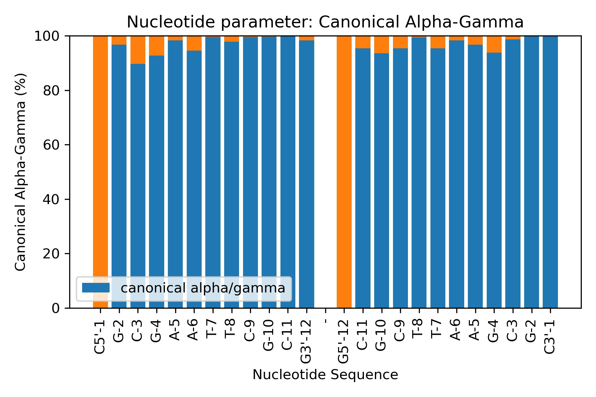
    


<a id="bIbII"></a>
#### BI/BII Population

##### Computing average values


```python
from biobb_dna.backbone.bipopulations import bipopulations

canal_epsilC = "canal_out/canal_output_epsilC.ser"
canal_epsilW = "canal_out/canal_output_epsilW.ser"
canal_zetaC = "canal_out/canal_output_zetaC.ser"
canal_zetaW = "canal_out/canal_output_zetaW.ser"

output_bIbII_csv_path = 'bIbII.averages.csv'
output_bIbII_jpg_path = 'bIbII.averages.jpg'

prop = {
    'sequence': seq
}

bipopulations(
    input_epsilC_path=canal_epsilC,
    input_epsilW_path=canal_epsilW,
    input_zetaC_path=canal_zetaC,
    input_zetaW_path=canal_zetaW,
    output_csv_path=output_bIbII_csv_path,
    output_jpg_path=output_bIbII_jpg_path,
    properties=prop)

```

##### Showing the calculated average values


```python
df = pd.read_csv(output_bIbII_csv_path)
df
```


<div>
<style scoped>
    .dataframe tbody tr th:only-of-type {
        vertical-align: middle;
    }

    .dataframe tbody tr th {
        vertical-align: top;
    }

    .dataframe thead th {
        text-align: right;
    }
</style>
<table border="1" class="dataframe">
  <thead>
    <tr style="text-align: right;">
      <th></th>
      <th>Nucleotide</th>
      <th>BI population</th>
      <th>BII population</th>
    </tr>
  </thead>
  <tbody>
    <tr>
      <th>0</th>
      <td>C5'-1</td>
      <td>83.523295</td>
      <td>16.476705</td>
    </tr>
    <tr>
      <th>1</th>
      <td>G-2</td>
      <td>74.085183</td>
      <td>25.914817</td>
    </tr>
    <tr>
      <th>2</th>
      <td>C-3</td>
      <td>85.982803</td>
      <td>14.017197</td>
    </tr>
    <tr>
      <th>3</th>
      <td>G-4</td>
      <td>75.924815</td>
      <td>24.075185</td>
    </tr>
    <tr>
      <th>4</th>
      <td>A-5</td>
      <td>67.846431</td>
      <td>32.153569</td>
    </tr>
    <tr>
      <th>5</th>
      <td>A-6</td>
      <td>59.588082</td>
      <td>40.411918</td>
    </tr>
    <tr>
      <th>6</th>
      <td>T-7</td>
      <td>65.406919</td>
      <td>34.593081</td>
    </tr>
    <tr>
      <th>7</th>
      <td>T-8</td>
      <td>75.524895</td>
      <td>24.475105</td>
    </tr>
    <tr>
      <th>8</th>
      <td>C-9</td>
      <td>79.504099</td>
      <td>20.495901</td>
    </tr>
    <tr>
      <th>9</th>
      <td>G-10</td>
      <td>77.644471</td>
      <td>22.355529</td>
    </tr>
    <tr>
      <th>10</th>
      <td>C-11</td>
      <td>82.003599</td>
      <td>17.996401</td>
    </tr>
    <tr>
      <th>11</th>
      <td>G3'-12</td>
      <td>0.000000</td>
      <td>100.000000</td>
    </tr>
    <tr>
      <th>12</th>
      <td>-</td>
      <td>0.000000</td>
      <td>100.000000</td>
    </tr>
    <tr>
      <th>13</th>
      <td>G5'-12</td>
      <td>82.443511</td>
      <td>17.556489</td>
    </tr>
    <tr>
      <th>14</th>
      <td>C-11</td>
      <td>73.305339</td>
      <td>26.694661</td>
    </tr>
    <tr>
      <th>15</th>
      <td>G-10</td>
      <td>84.483103</td>
      <td>15.516897</td>
    </tr>
    <tr>
      <th>16</th>
      <td>C-9</td>
      <td>74.305139</td>
      <td>25.694861</td>
    </tr>
    <tr>
      <th>17</th>
      <td>T-8</td>
      <td>67.606479</td>
      <td>32.393521</td>
    </tr>
    <tr>
      <th>18</th>
      <td>T-7</td>
      <td>59.568086</td>
      <td>40.431914</td>
    </tr>
    <tr>
      <th>19</th>
      <td>A-6</td>
      <td>67.126575</td>
      <td>32.873425</td>
    </tr>
    <tr>
      <th>20</th>
      <td>A-5</td>
      <td>76.984603</td>
      <td>23.015397</td>
    </tr>
    <tr>
      <th>21</th>
      <td>G-4</td>
      <td>80.243951</td>
      <td>19.756049</td>
    </tr>
    <tr>
      <th>22</th>
      <td>C-3</td>
      <td>77.604479</td>
      <td>22.395521</td>
    </tr>
    <tr>
      <th>23</th>
      <td>G-2</td>
      <td>81.443711</td>
      <td>18.556289</td>
    </tr>
    <tr>
      <th>24</th>
      <td>C3'-1</td>
      <td>0.000000</td>
      <td>100.000000</td>
    </tr>
  </tbody>
</table>
</div>


##### Plotting the average values 


```python
Image(filename=output_bIbII_jpg_path,width = 600)
```


    
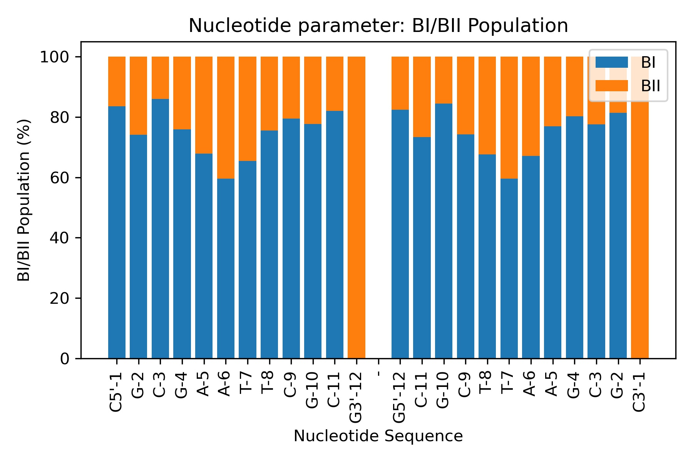
    


<a id="timeseries"></a>
## Extracting Time series Helical Parameters

**Time series** values for the set of **helical parameters** can be also extracted from the output of **Curves+/Canal** execution on **Molecular Dynamics Trajectories**. The **helical parameters** can be divided in the same 5 main blocks previously introduced:

- Helical Base Pair Step (Inter-Base Pair) Helical Parameters
- Helical Base Pair (Intra-Base Pair) Helical Parameters
- Axis Base Pair
- Grooves
- Backbone Torsions

***
**Building Block** used:
- [dna_timeseries](https://biobb-dna.readthedocs.io/en/latest/dna.html#module-dna.dna_timeseries) from **biobb_dna.dna.dna_timeseries**
***

### Extracting a particular Helical Parameter

**Time series** values can be extracted from any of the **helical parameters** previously introduced. To illustrate the steps needed, the **base-pair step helical parameter** ***Twist*** has been selected. Please note that computing the **time series** values for a different **helical parameter** just requires modifying the ***helpar*** variable from the next cell.  


```python
from biobb_dna.dna.dna_timeseries import dna_timeseries

# Modify the next variable to extract time series values for a different helical parameter
# Possible values are: 
    # Base Pair Step (Inter Base Pair) Helical Parameters: shift, slide, rise, tilt, roll, twist 
    # Base Pair (Intra Base Pair) Helical Parameters: shear, stretch, stagger, buckle, propeller, opening
    # Axis Parameters: inclin, tip, xdisp, ydisp
    # Backbone Torsions Parameters: alphaC, alphaW, betaC, betaW, gammaC, gammaW, deltaC, deltaW,
    #                                epsilC, epsilW, zetaC, zetaW, chiC, chiW, phaseC, phaseW
    # Grooves: mind, minw, majd, majw

helpar = "twist" # Modify this variable to extract time series values for a different helical parameter

input_file_path = "canal_out/canal_output" + "_" + helpar + ".ser"
output_timeseries_file_path = helpar + '.timeseries.zip'

prop = {
    'helpar_name': helpar,
    'sequence': seq
}

dna_timeseries(
    input_ser_path=input_file_path,
    output_zip_path=output_timeseries_file_path,
    properties=prop)
```

### Extracting time series results for the selected helical parameter in a temporary folder


```python
timeseries_dir = "timeseries"

if Path(timeseries_dir).exists(): shutil.rmtree(timeseries_dir) 
os.mkdir(timeseries_dir)

with zipfile.ZipFile(output_timeseries_file_path, 'r') as zip_ref:
    zip_ref.extractall(timeseries_dir)
```

### Finding out all the possible nucleotide / base / base-pair / base-pair steps

Discover all the possible **nucleotide / base / base-pair / base-pair steps** from the **sequence**. The unit will depend on the helical parameter being studied.  
**Select one of them** to study the **time series** values of the **helical parameter** along the **simulation**.


```python
helpartimesfiles = glob.glob(timeseries_dir + "/*series*.csv") 

helpartimes = []
for file in helpartimesfiles:
    new_string = file.replace(timeseries_dir + "/series_" + helpar + "_", "")
    new_string = new_string.replace(".csv" , "")
    helpartimes.append(new_string)
    
timesel = ipywidgets.Dropdown(
    options=helpartimes,
    description='Sel. BPS:',
    disabled=False,
)
display(timesel)
```

### Showing the time series values for the selected unit


```python
file_ser = timeseries_dir + "/series_" + helpar + "_" + timesel.value + ".csv"

df = pd.read_csv(file_ser)
df
```


<div>
<style scoped>
    .dataframe tbody tr th:only-of-type {
        vertical-align: middle;
    }

    .dataframe tbody tr th {
        vertical-align: top;
    }

    .dataframe thead th {
        text-align: right;
    }
</style>
<table border="1" class="dataframe">
  <thead>
    <tr style="text-align: right;">
      <th></th>
      <th>Unnamed: 0</th>
      <th>6_TT</th>
    </tr>
  </thead>
  <tbody>
    <tr>
      <th>0</th>
      <td>0</td>
      <td>24.83</td>
    </tr>
    <tr>
      <th>1</th>
      <td>1</td>
      <td>36.78</td>
    </tr>
    <tr>
      <th>2</th>
      <td>2</td>
      <td>41.00</td>
    </tr>
    <tr>
      <th>3</th>
      <td>3</td>
      <td>33.50</td>
    </tr>
    <tr>
      <th>4</th>
      <td>4</td>
      <td>29.68</td>
    </tr>
    <tr>
      <th>...</th>
      <td>...</td>
      <td>...</td>
    </tr>
    <tr>
      <th>4995</th>
      <td>4995</td>
      <td>42.40</td>
    </tr>
    <tr>
      <th>4996</th>
      <td>4996</td>
      <td>44.61</td>
    </tr>
    <tr>
      <th>4997</th>
      <td>4997</td>
      <td>39.61</td>
    </tr>
    <tr>
      <th>4998</th>
      <td>4998</td>
      <td>36.93</td>
    </tr>
    <tr>
      <th>4999</th>
      <td>4999</td>
      <td>36.63</td>
    </tr>
  </tbody>
</table>
<p>5000 rows × 2 columns</p>
</div>


```python
file_hist = timeseries_dir + "/hist_" + helpar + "_" + timesel.value + ".csv"

df = pd.read_csv(file_hist)
df
```


<div>
<style scoped>
    .dataframe tbody tr th:only-of-type {
        vertical-align: middle;
    }

    .dataframe tbody tr th {
        vertical-align: top;
    }

    .dataframe thead th {
        text-align: right;
    }
</style>
<table border="1" class="dataframe">
  <thead>
    <tr style="text-align: right;">
      <th></th>
      <th>twist</th>
      <th>density</th>
    </tr>
  </thead>
  <tbody>
    <tr>
      <th>0</th>
      <td>14.410000</td>
      <td>1.0</td>
    </tr>
    <tr>
      <th>1</th>
      <td>15.203617</td>
      <td>0.0</td>
    </tr>
    <tr>
      <th>2</th>
      <td>15.997234</td>
      <td>2.0</td>
    </tr>
    <tr>
      <th>3</th>
      <td>16.790851</td>
      <td>1.0</td>
    </tr>
    <tr>
      <th>4</th>
      <td>17.584468</td>
      <td>1.0</td>
    </tr>
    <tr>
      <th>5</th>
      <td>18.378085</td>
      <td>1.0</td>
    </tr>
    <tr>
      <th>6</th>
      <td>19.171702</td>
      <td>5.0</td>
    </tr>
    <tr>
      <th>7</th>
      <td>19.965319</td>
      <td>3.0</td>
    </tr>
    <tr>
      <th>8</th>
      <td>20.758936</td>
      <td>5.0</td>
    </tr>
    <tr>
      <th>9</th>
      <td>21.552553</td>
      <td>11.0</td>
    </tr>
    <tr>
      <th>10</th>
      <td>22.346170</td>
      <td>10.0</td>
    </tr>
    <tr>
      <th>11</th>
      <td>23.139787</td>
      <td>21.0</td>
    </tr>
    <tr>
      <th>12</th>
      <td>23.933404</td>
      <td>20.0</td>
    </tr>
    <tr>
      <th>13</th>
      <td>24.727021</td>
      <td>34.0</td>
    </tr>
    <tr>
      <th>14</th>
      <td>25.520638</td>
      <td>43.0</td>
    </tr>
    <tr>
      <th>15</th>
      <td>26.314255</td>
      <td>61.0</td>
    </tr>
    <tr>
      <th>16</th>
      <td>27.107872</td>
      <td>80.0</td>
    </tr>
    <tr>
      <th>17</th>
      <td>27.901489</td>
      <td>91.0</td>
    </tr>
    <tr>
      <th>18</th>
      <td>28.695106</td>
      <td>114.0</td>
    </tr>
    <tr>
      <th>19</th>
      <td>29.488723</td>
      <td>138.0</td>
    </tr>
    <tr>
      <th>20</th>
      <td>30.282340</td>
      <td>176.0</td>
    </tr>
    <tr>
      <th>21</th>
      <td>31.075957</td>
      <td>181.0</td>
    </tr>
    <tr>
      <th>22</th>
      <td>31.869574</td>
      <td>208.0</td>
    </tr>
    <tr>
      <th>23</th>
      <td>32.663191</td>
      <td>248.0</td>
    </tr>
    <tr>
      <th>24</th>
      <td>33.456809</td>
      <td>265.0</td>
    </tr>
    <tr>
      <th>25</th>
      <td>34.250426</td>
      <td>280.0</td>
    </tr>
    <tr>
      <th>26</th>
      <td>35.044043</td>
      <td>300.0</td>
    </tr>
    <tr>
      <th>27</th>
      <td>35.837660</td>
      <td>327.0</td>
    </tr>
    <tr>
      <th>28</th>
      <td>36.631277</td>
      <td>321.0</td>
    </tr>
    <tr>
      <th>29</th>
      <td>37.424894</td>
      <td>304.0</td>
    </tr>
    <tr>
      <th>30</th>
      <td>38.218511</td>
      <td>270.0</td>
    </tr>
    <tr>
      <th>31</th>
      <td>39.012128</td>
      <td>298.0</td>
    </tr>
    <tr>
      <th>32</th>
      <td>39.805745</td>
      <td>243.0</td>
    </tr>
    <tr>
      <th>33</th>
      <td>40.599362</td>
      <td>234.0</td>
    </tr>
    <tr>
      <th>34</th>
      <td>41.392979</td>
      <td>196.0</td>
    </tr>
    <tr>
      <th>35</th>
      <td>42.186596</td>
      <td>169.0</td>
    </tr>
    <tr>
      <th>36</th>
      <td>42.980213</td>
      <td>115.0</td>
    </tr>
    <tr>
      <th>37</th>
      <td>43.773830</td>
      <td>78.0</td>
    </tr>
    <tr>
      <th>38</th>
      <td>44.567447</td>
      <td>47.0</td>
    </tr>
    <tr>
      <th>39</th>
      <td>45.361064</td>
      <td>39.0</td>
    </tr>
    <tr>
      <th>40</th>
      <td>46.154681</td>
      <td>18.0</td>
    </tr>
    <tr>
      <th>41</th>
      <td>46.948298</td>
      <td>17.0</td>
    </tr>
    <tr>
      <th>42</th>
      <td>47.741915</td>
      <td>10.0</td>
    </tr>
    <tr>
      <th>43</th>
      <td>48.535532</td>
      <td>9.0</td>
    </tr>
    <tr>
      <th>44</th>
      <td>49.329149</td>
      <td>2.0</td>
    </tr>
    <tr>
      <th>45</th>
      <td>50.122766</td>
      <td>1.0</td>
    </tr>
    <tr>
      <th>46</th>
      <td>50.916383</td>
      <td>2.0</td>
    </tr>
  </tbody>
</table>
</div>


### Plotting the time series values for the selected base-pair step 


```python
file_ser = timeseries_dir + "/series_" + helpar + "_" + timesel.value + ".jpg"
file_hist = timeseries_dir + "/hist_" + helpar + "_" + timesel.value + ".jpg"

images = []

images.append(file_ser)
images.append(file_hist)

f, axarr = plt.subplots(1, 2, figsize=(50, 15))

for i, image in enumerate(images):
    img = mpimg.imread(image)

    axarr[i].imshow(img, aspect='auto')
    axarr[i].axis('off')

plt.show()
```


    
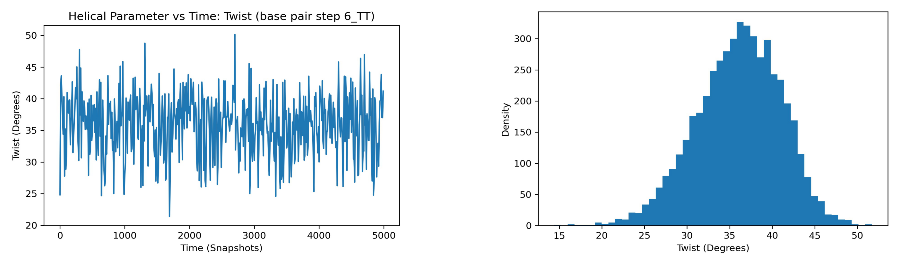
    


### Computing timeseries for all base-pair step parameters 


```python
from biobb_dna.dna.dna_timeseries import dna_timeseries

output_timeseries_bps_file_paths = {}
for helpar in base_pair_step:

    input_file_path = "canal_out/canal_output" + "_" + helpar + ".ser"
    output_timeseries_bps_file_paths[helpar] = helpar + '.timeseries.zip'

    prop = {
        'helpar_name': helpar,
        'sequence': seq
    }

    dna_timeseries(
        input_ser_path=input_file_path,
        output_zip_path=output_timeseries_bps_file_paths[helpar],
        properties=prop)
```


```python
#if Path(timeseries_dir).exists(): shutil.rmtree(timeseries_dir) 
#os.mkdir(timeseries_dir)

for timeseries_zipfile in output_timeseries_bps_file_paths.values():
    with zipfile.ZipFile(timeseries_zipfile, 'r') as zip_ref:
        zip_ref.extractall(timeseries_dir)
```

### Computing timeseries for all base-pair parameters 


```python
from biobb_dna.dna.dna_timeseries import dna_timeseries

output_timeseries_bp_file_paths = {}
for helpar in base_pair:

    input_file_path = "canal_out/canal_output" + "_" + helpar + ".ser"
    output_timeseries_bp_file_paths[helpar] = helpar + '.timeseries.zip'

    prop = {
        'helpar_name': helpar,
        'sequence': seq
    }

    dna_timeseries(
        input_ser_path=input_file_path,
        output_zip_path=output_timeseries_bp_file_paths[helpar],
        properties=prop)
```


```python
#if Path(timeseries_dir).exists(): shutil.rmtree(timeseries_dir) 
#os.mkdir(timeseries_dir)

for timeseries_zipfile in output_timeseries_bp_file_paths.values():
    with zipfile.ZipFile(timeseries_zipfile, 'r') as zip_ref:
        zip_ref.extractall(timeseries_dir)
```

### Computing timeseries for all axis parameters 


```python
from biobb_dna.dna.dna_timeseries import dna_timeseries

output_timeseries_bp_file_paths = {}
for helpar in axis_base_pairs:

    input_file_path = "canal_out/canal_output" + "_" + helpar + ".ser"
    output_timeseries_bp_file_paths[helpar] = helpar + '.timeseries.zip'

    prop = {
        'helpar_name': helpar,
        'sequence': seq
    }

    dna_timeseries(
        input_ser_path=input_file_path,
        output_zip_path=output_timeseries_bp_file_paths[helpar],
        properties=prop)
```


```python
for timeseries_zipfile in output_timeseries_bp_file_paths.values():
    with zipfile.ZipFile(timeseries_zipfile, 'r') as zip_ref:
        zip_ref.extractall(timeseries_dir)
```

### Computing timeseries for all grooves parameters 


```python
from biobb_dna.dna.dna_timeseries import dna_timeseries

output_timeseries_bp_file_paths = {}
for helpar in grooves:

    input_file_path = "canal_out/canal_output" + "_" + helpar + ".ser"
    output_timeseries_bp_file_paths[helpar] = helpar + '.timeseries.zip'

    prop = {
        'helpar_name': helpar,
        'sequence': seq
    }

    dna_timeseries(
        input_ser_path=input_file_path,
        output_zip_path=output_timeseries_bp_file_paths[helpar],
        properties=prop)
```


```python
for timeseries_zipfile in output_timeseries_bp_file_paths.values():
    with zipfile.ZipFile(timeseries_zipfile, 'r') as zip_ref:
        zip_ref.extractall(timeseries_dir)
```

### Computing timeseries for all backbone torsions parameters 


```python
from biobb_dna.dna.dna_timeseries import dna_timeseries

output_timeseries_bp_file_paths = {}
for helpar in backbone_torsions:

    input_file_path = "canal_out/canal_output" + "_" + helpar + ".ser"
    output_timeseries_bp_file_paths[helpar] = helpar + '.timeseries.zip'

    prop = {
        'helpar_name': helpar,
        'sequence': seq
    }

    dna_timeseries(
        input_ser_path=input_file_path,
        output_zip_path=output_timeseries_bp_file_paths[helpar],
        properties=prop)
```


```python
for timeseries_zipfile in output_timeseries_bp_file_paths.values():
    with zipfile.ZipFile(timeseries_zipfile, 'r') as zip_ref:
        zip_ref.extractall(timeseries_dir)
```

<a id="stiffness"></a>
## Stiffness

**Molecular stiffness** is an **elastic force constant** associated with **helical deformation** at the **base pair step** level and is determined by inversion of the covariance matrix in helical space, which yields **stiffness matrices** whose diagonal elements provide the **stiffness constants** associated with **pure rotational** (twist, roll and tilt) and **translational** (rise, shift and slide) **deformations** within the given step.

***

***
**Building Blocks** used:
- [average_stiffness](https://biobb-dna.readthedocs.io/en/latest/stiffness.html#module-stiffness.average_stiffness) from **biobb_dna.stiffness.average_stiffness** 
- [basepair_stiffness](https://biobb-dna.readthedocs.io/en/latest/stiffness.html#module-stiffness.basepair_stiffness) from **biobb_dna.stiffness.basepair_stiffness** 
***


```python
from biobb_dna.stiffness.average_stiffness import average_stiffness

helpar = "twist" # Modify this variable to extract time series values for a different helical parameter

input_file_path = "canal_out/canal_output" + "_" + helpar + ".ser"
output_stiffness_csv_path = helpar + '.stiffness.csv'
output_stiffness_jpg_path = helpar + '.stiffness.jpg'

prop = { 
    'sequence' : seq
}

average_stiffness(
    input_ser_path=input_file_path,
    output_csv_path=output_stiffness_csv_path,
    output_jpg_path=output_stiffness_jpg_path,
    properties=prop)

```


```python
df = pd.read_csv(output_stiffness_csv_path)
df
```


<div>
<style scoped>
    .dataframe tbody tr th:only-of-type {
        vertical-align: middle;
    }

    .dataframe tbody tr th {
        vertical-align: top;
    }

    .dataframe thead th {
        text-align: right;
    }
</style>
<table border="1" class="dataframe">
  <thead>
    <tr style="text-align: right;">
      <th></th>
      <th>Unnamed: 0</th>
      <th>twist_stiffness</th>
    </tr>
  </thead>
  <tbody>
    <tr>
      <th>0</th>
      <td>GC</td>
      <td>0.029784</td>
    </tr>
    <tr>
      <th>1</th>
      <td>CG</td>
      <td>0.018300</td>
    </tr>
    <tr>
      <th>2</th>
      <td>GA</td>
      <td>0.028595</td>
    </tr>
    <tr>
      <th>3</th>
      <td>AA</td>
      <td>0.033391</td>
    </tr>
    <tr>
      <th>4</th>
      <td>AT</td>
      <td>0.057062</td>
    </tr>
    <tr>
      <th>5</th>
      <td>TT</td>
      <td>0.031410</td>
    </tr>
    <tr>
      <th>6</th>
      <td>TC</td>
      <td>0.029772</td>
    </tr>
    <tr>
      <th>7</th>
      <td>CG</td>
      <td>0.019181</td>
    </tr>
    <tr>
      <th>8</th>
      <td>GC</td>
      <td>0.031688</td>
    </tr>
    <tr>
      <th>9</th>
      <td>CG</td>
      <td>0.005167</td>
    </tr>
  </tbody>
</table>
</div>


```python
Image(filename=output_stiffness_jpg_path,width = 600)
```


    
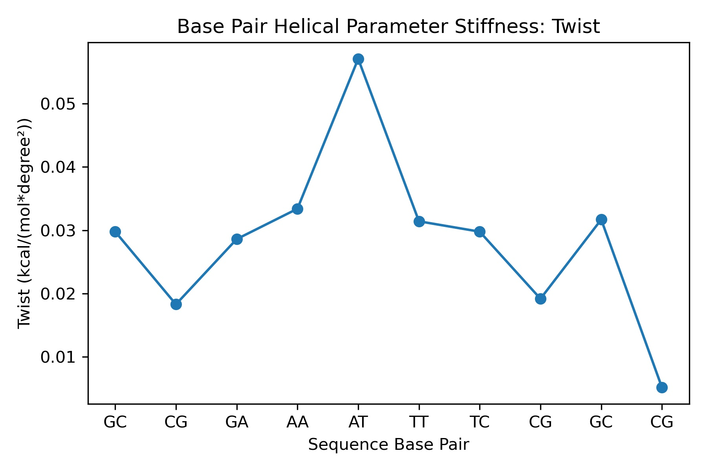
    


```python
from biobb_dna.stiffness.basepair_stiffness import basepair_stiffness

timeseries_shift = timeseries_dir+"/series_shift_" + timesel.value + ".csv"
timeseries_slide = timeseries_dir+"/series_slide_" + timesel.value + ".csv"
timeseries_rise = timeseries_dir+"/series_rise_" + timesel.value + ".csv"
timeseries_tilt = timeseries_dir+"/series_tilt_" + timesel.value + ".csv"
timeseries_roll = timeseries_dir+"/series_roll_" + timesel.value + ".csv"
timeseries_twist = timeseries_dir+"/series_twist_" + timesel.value + ".csv"

output_stiffness_bps_csv_path = "stiffness_bps.csv"
output_stiffness_bps_jpg_path = "stiffness_bps.jpg"

basepair_stiffness(
    input_filename_shift=timeseries_shift,
    input_filename_slide=timeseries_slide,
    input_filename_rise=timeseries_rise,
    input_filename_tilt=timeseries_tilt,
    input_filename_roll=timeseries_roll,
    input_filename_twist=timeseries_twist,
    output_csv_path=output_stiffness_bps_csv_path,
    output_jpg_path=output_stiffness_bps_jpg_path)
```


```python
df = pd.read_csv(output_stiffness_bps_csv_path)
df
```


<div>
<style scoped>
    .dataframe tbody tr th:only-of-type {
        vertical-align: middle;
    }

    .dataframe tbody tr th {
        vertical-align: top;
    }

    .dataframe thead th {
        text-align: right;
    }
</style>
<table border="1" class="dataframe">
  <thead>
    <tr style="text-align: right;">
      <th></th>
      <th>6_TT</th>
      <th>shift</th>
      <th>slide</th>
      <th>rise</th>
      <th>tilt</th>
      <th>roll</th>
      <th>twist</th>
    </tr>
  </thead>
  <tbody>
    <tr>
      <th>0</th>
      <td>shift</td>
      <td>1.565629</td>
      <td>-0.750135</td>
      <td>-0.335147</td>
      <td>-0.263984</td>
      <td>-0.153248</td>
      <td>-0.220935</td>
    </tr>
    <tr>
      <th>1</th>
      <td>slide</td>
      <td>-0.750135</td>
      <td>3.535266</td>
      <td>1.335823</td>
      <td>-0.095199</td>
      <td>-0.287142</td>
      <td>-2.104566</td>
    </tr>
    <tr>
      <th>2</th>
      <td>rise</td>
      <td>-0.335147</td>
      <td>1.335823</td>
      <td>5.158742</td>
      <td>0.637038</td>
      <td>0.415877</td>
      <td>-1.293672</td>
    </tr>
    <tr>
      <th>3</th>
      <td>tilt</td>
      <td>-0.024904</td>
      <td>-0.008981</td>
      <td>0.060098</td>
      <td>0.235447</td>
      <td>0.015406</td>
      <td>-0.008404</td>
    </tr>
    <tr>
      <th>4</th>
      <td>roll</td>
      <td>-0.014457</td>
      <td>-0.027089</td>
      <td>0.039234</td>
      <td>0.015406</td>
      <td>0.119149</td>
      <td>0.038313</td>
    </tr>
    <tr>
      <th>5</th>
      <td>twist</td>
      <td>-0.020843</td>
      <td>-0.198544</td>
      <td>-0.122045</td>
      <td>-0.008404</td>
      <td>0.038313</td>
      <td>0.412179</td>
    </tr>
  </tbody>
</table>
</div>


```python
Image(filename=output_stiffness_bps_jpg_path,width = 600)
```


    
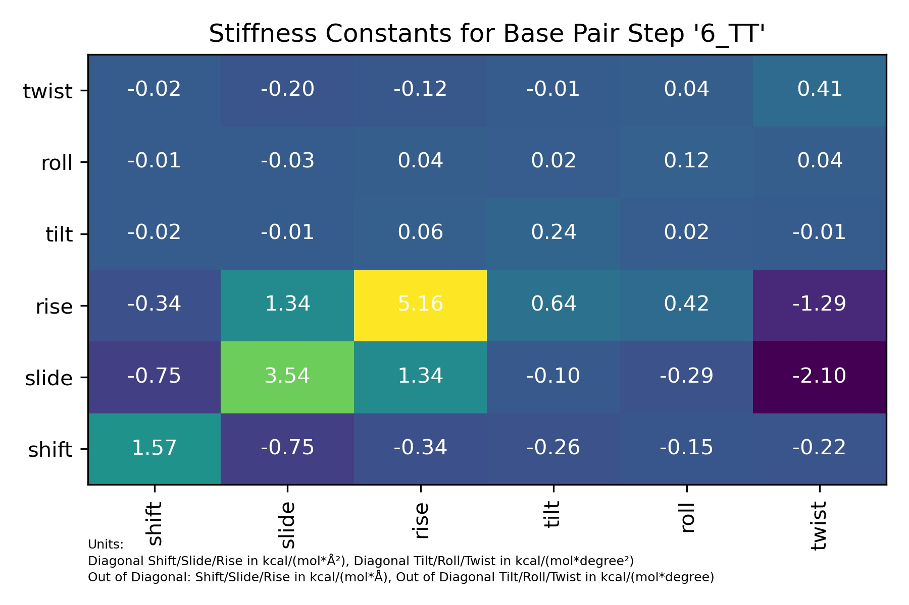
    


<a id="bimodality"></a>
## Bimodality

**Base-pair steps** helical parameters usually follow a normal (Gaussian-like) distribution. However, recent studies observed **bimodal distributions** in some **base-pair steps** for **twist and slide**, highlighting potential caveats on the **harmonic approximation** implicit in **elastic analysis** and mesoscopic models of DNA flexibility.

***

***

**μABC: a systematic microsecond molecular dynamics study of tetranucleotide sequence effects in B-DNA**<br>
*Marco Pasi, John H Maddocks, David Beveridge, Thomas C Bishop, David A Case, Thomas Cheatham 3rd, Pablo D Dans, B Jayaram, Filip Lankas, Charles Laughton, Jonathan Mitchell, Roman Osman, Modesto Orozco, Alberto Pérez, Daiva Petkevičiūtė, Nada Spackova, Jiri Sponer, Krystyna Zakrzewska, Richard Lavery*<br>
***Nucleic Acids Research 2014, Volume 42, Issue 19, Pages 12272-12283***<br>
[https://doi.org/10.1093/nar/gku855](https://doi.org/10.1093/nar/gku855)

**Exploring polymorphisms in B-DNA helical conformations**<br>
*Pablo D Dans, Alberto Pérez, Ignacio Faustino, Richard Lavery, Modesto Orozco*<br>
***Nucleic Acids Research 2012, Volume 40, Issue 21, Pages 10668-10678***<br>
[https://doi.org/10.1093/nar/gks884](https://doi.org/10.1093/nar/gks884)

**A systematic molecular dynamics study of nearest-neighbor effects on base pair and base pair step conformations and fluctuations in B-DNA**<br>
*Lavery R, Zakrzewska K, Beveridge D, Bishop TC, Case DA, Cheatham T, III, Dixit S, Jayaram B, Lankas F, Laughton C, John H Maddocks, Alexis Michon, Roman Osman, Modesto Orozco, Alberto Perez, Tanya Singh, Nada Spackova, Jiri Sponer*<br>
***Nucleic Acids Research 2010, Volume 38, Pages 299–313***<br>
[https://doi.org/10.1093/nar/gkp834](https://doi.org/10.1093/nar/gkp834)

***

**Building Block** used:
- [dna_bimodality](https://biobb-dna.readthedocs.io/en/latest/dna.html#module-dna.dna_bimodality) from **biobb_dna.dna.bimodality** 
***


```python
from biobb_dna.dna.dna_bimodality import dna_bimodality

helpar = "twist"
input_csv = timeseries_dir+"/series_"+helpar+"_"+timesel.value+'.csv'
#input_csv = "/Users/hospital/biobb_tutorials/biobb_dna/timeseries"+"/series_"+timesel.value+'.csv' # <-- TO BE REPLACED BY PREVIOUS LINE 

output_bimodality_csv = helpar+'.bimodality.csv'
output_bimodality_jpg = helpar+'.bimodality.jpg'

prop = {
    'max_iter': 500
}
dna_bimodality(
    input_csv_file=input_csv,
    output_csv_path=output_bimodality_csv,
    output_jpg_path=output_bimodality_jpg,
    properties=prop)
```


```python
file_hist = timeseries_dir + "/hist_" + helpar + "_" + timesel.value + ".jpg"
file_bi = helpar + ".bimodality.jpg"

images = []

images.append(file_hist)
images.append(file_bi)

f, axarr = plt.subplots(1, 2, figsize=(50, 15))

for i, image in enumerate(images):
    img = mpimg.imread(image)

    axarr[i].imshow(img, aspect='auto')
    axarr[i].axis('off')

plt.show()
```


    
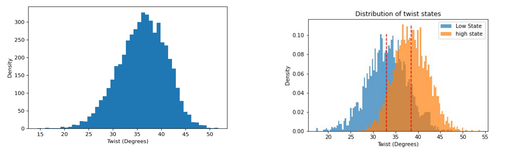
    


<a id="correlations"></a>
## Correlations

Sequence-dependent **correlation movements** have been identified in DNA conformational analysis at the **base pair** and **base pair-step** level. **Trinucleotides** were found to show moderate to high **correlations** in some **intra base pair helical parameter** (e.g. shear-opening, shear-stretch, stagger-buckle). Similarly, some **tetranucleotides** are showing strong **correlations** in their **inter base pair helical parameters** (e.g. shift-tilt, slide-twist, rise-tilt, shift-slide, and shift-twist in RR steps), with **negative correlations** in the shift-slide and roll-twist cases. **Correlations** are also observed in the combination of **inter- and intra-helical parameters** (e.g. shift-opening, rise-buckle, stagger-tilt). **Correlations** analysis can be also extended to **neighboring steps** (e.g. twist in the central YR step of XYRR tetranucleotides with slide in the adjacent RR step). 

- [Sequence Correlations: Intra-base pairs](#intraseqcorr)
- [Sequence Correlations: Inter-base pair steps](#interseqcorr)
- [Helical Parameter Correlations: Intra-base pairs](#intrahpcorr)
- [Helical Parameter Correlations: Inter-base pair steps](#interhpcorr)
- [Neighboring steps Correlations: Intra-base pairs](#intrabpcorr)
- [Neighboring steps Correlations: Inter-base pair steps](#interbpcorr)

***

***

**The static and dynamic structural heterogeneities of B-DNA: extending Calladine–Dickerson rules**<br>
*Pablo D Dans, Alexandra Balaceanu, Marco Pasi, Alessandro S Patelli, Daiva Petkevičiūtė, Jürgen Walther, Adam Hospital, Genís Bayarri, Richard Lavery, John H Maddocks, Modesto Orozco*
***Nucleic Acids Research 2019, Volume 47, Issue 21, Pages 11090-11102***<br>
[https://doi.org/10.1093/nar/gkz905](https://doi.org/10.1093/nar/gkz905)

***

**Building Blocks** used:
- [intraseqcorr](https://biobb-dna.readthedocs.io/en/latest/intrabp_correlations.html#module-intrabp_correlations.intraseqcorr) from **biobb_dna.intrabp_correlations.intraseqcorr** 
- [interseqcorr](https://biobb-dna.readthedocs.io/en/latest/interbp_correlations.html#interbp-correlations-interseqcorr-module) from **biobb_dna.interbp_correlations.interseqcorr** 
- [intrahpcorr](https://biobb-dna.readthedocs.io/en/latest/intrabp_correlations.html#intrabp-correlations-intrahpcorr-module) from **biobb_dna.intrabp_correlations.intrahpcorr** 
- [interhpcorr](https://biobb-dna.readthedocs.io/en/latest/interbp_correlations.html#interbp-correlations-interhpcorr-module) from **biobb_dna.interbp_correlations.interhpcorr** 
- [intrabpcorr](https://biobb-dna.readthedocs.io/en/latest/intrabp_correlations.html#intrabp-correlations-intrabpcorr-module) from **biobb_dna.intrabp_correlations.intrabpcorr** 
- [interbpcorr](https://biobb-dna.readthedocs.io/en/latest/interbp_correlations.html#interbp-correlations-interbpcorr-module) from **biobb_dna.interbp_correlations.interbpcorr** 

***

<a id="intraseqcorr"></a>
### Sequence Correlations: Intra-base pairs


```python
from biobb_dna.intrabp_correlations.intraseqcorr import intraseqcorr

input_file_path = "canal_out/canal_output" + "_" + helpar + ".ser"
output_intrabp_correlation_csv_path = helpar+'.intrabp_correlation.csv'
output_intrabp_correlation_jpg_path = helpar+'.intrabp_correlation.jpg'

prop={
    'sequence' : seq,
#    'helpar_name' : 'Rise'
}

intraseqcorr(
    input_ser_path=input_file_path,
    output_csv_path=output_intrabp_correlation_csv_path,
    output_jpg_path=output_intrabp_correlation_jpg_path,
    properties=prop)
```


```python
df = pd.read_csv(output_intrabp_correlation_csv_path)
df
```


<div>
<style scoped>
    .dataframe tbody tr th:only-of-type {
        vertical-align: middle;
    }

    .dataframe tbody tr th {
        vertical-align: top;
    }

    .dataframe thead th {
        text-align: right;
    }
</style>
<table border="1" class="dataframe">
  <thead>
    <tr style="text-align: right;">
      <th></th>
      <th>Unnamed: 0</th>
      <th>G</th>
      <th>C</th>
      <th>G_dup</th>
      <th>A</th>
      <th>A_dup</th>
      <th>T</th>
      <th>T_dup</th>
      <th>C_dup</th>
      <th>G_dup_dup</th>
      <th>C_dup_dup</th>
    </tr>
  </thead>
  <tbody>
    <tr>
      <th>0</th>
      <td>G</td>
      <td>1.000000</td>
      <td>-0.358404</td>
      <td>0.068163</td>
      <td>0.009405</td>
      <td>0.001087</td>
      <td>0.019698</td>
      <td>-0.015957</td>
      <td>0.007849</td>
      <td>0.031577</td>
      <td>0.010621</td>
    </tr>
    <tr>
      <th>1</th>
      <td>C</td>
      <td>-0.358404</td>
      <td>1.000000</td>
      <td>-0.448247</td>
      <td>-0.007771</td>
      <td>0.026130</td>
      <td>-0.000455</td>
      <td>-0.005333</td>
      <td>-0.013427</td>
      <td>0.001874</td>
      <td>0.025165</td>
    </tr>
    <tr>
      <th>2</th>
      <td>G_dup</td>
      <td>0.068163</td>
      <td>-0.448247</td>
      <td>1.000000</td>
      <td>-0.335686</td>
      <td>-0.048327</td>
      <td>-0.029954</td>
      <td>0.018416</td>
      <td>0.013668</td>
      <td>-0.026111</td>
      <td>0.016239</td>
    </tr>
    <tr>
      <th>3</th>
      <td>A</td>
      <td>0.009405</td>
      <td>-0.007771</td>
      <td>-0.335686</td>
      <td>1.000000</td>
      <td>-0.293111</td>
      <td>0.070316</td>
      <td>-0.003760</td>
      <td>0.006406</td>
      <td>-0.000036</td>
      <td>0.007260</td>
    </tr>
    <tr>
      <th>4</th>
      <td>A_dup</td>
      <td>0.001087</td>
      <td>0.026130</td>
      <td>-0.048327</td>
      <td>-0.293111</td>
      <td>1.000000</td>
      <td>-0.273114</td>
      <td>-0.056474</td>
      <td>0.001153</td>
      <td>-0.002821</td>
      <td>-0.016981</td>
    </tr>
    <tr>
      <th>5</th>
      <td>T</td>
      <td>0.019698</td>
      <td>-0.000455</td>
      <td>-0.029954</td>
      <td>0.070316</td>
      <td>-0.273114</td>
      <td>1.000000</td>
      <td>-0.335193</td>
      <td>-0.006889</td>
      <td>-0.001462</td>
      <td>0.017912</td>
    </tr>
    <tr>
      <th>6</th>
      <td>T_dup</td>
      <td>-0.015957</td>
      <td>-0.005333</td>
      <td>0.018416</td>
      <td>-0.003760</td>
      <td>-0.056474</td>
      <td>-0.335193</td>
      <td>1.000000</td>
      <td>-0.447663</td>
      <td>0.059009</td>
      <td>0.019932</td>
    </tr>
    <tr>
      <th>7</th>
      <td>C_dup</td>
      <td>0.007849</td>
      <td>-0.013427</td>
      <td>0.013668</td>
      <td>0.006406</td>
      <td>0.001153</td>
      <td>-0.006889</td>
      <td>-0.447663</td>
      <td>1.000000</td>
      <td>-0.372677</td>
      <td>0.014933</td>
    </tr>
    <tr>
      <th>8</th>
      <td>G_dup_dup</td>
      <td>0.031577</td>
      <td>0.001874</td>
      <td>-0.026111</td>
      <td>-0.000036</td>
      <td>-0.002821</td>
      <td>-0.001462</td>
      <td>0.059009</td>
      <td>-0.372677</td>
      <td>1.000000</td>
      <td>-0.236134</td>
    </tr>
    <tr>
      <th>9</th>
      <td>C_dup_dup</td>
      <td>0.010621</td>
      <td>0.025165</td>
      <td>0.016239</td>
      <td>0.007260</td>
      <td>-0.016981</td>
      <td>0.017912</td>
      <td>0.019932</td>
      <td>0.014933</td>
      <td>-0.236134</td>
      <td>1.000000</td>
    </tr>
  </tbody>
</table>
</div>


```python
Image(filename=output_intrabp_correlation_jpg_path,width = 600)
```


    
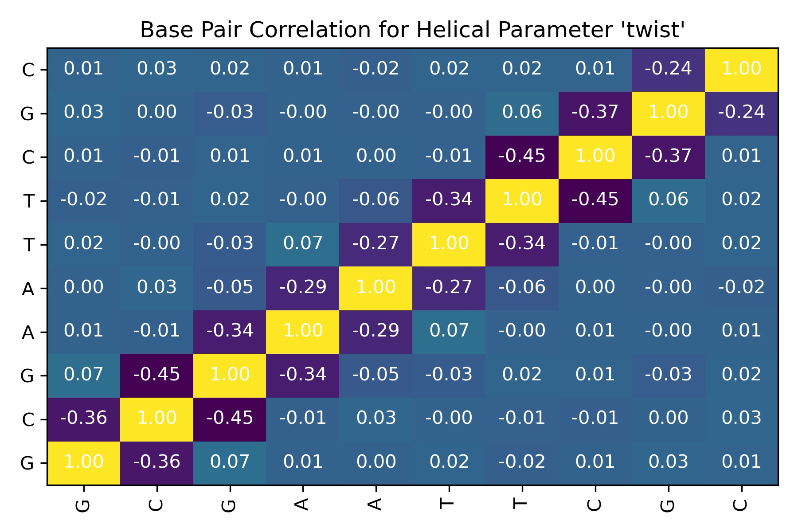
    


<a id="interseqcorr"></a>
### Sequence Correlations: Inter-base pair steps


```python
from biobb_dna.interbp_correlations.interseqcorr import interseqcorr

input_file_path = "canal_out/canal_output" + "_" + helpar + ".ser"
output_interbp_correlation_csv_path = helpar+'.interbp_correlation.csv'
output_interbp_correlation_jpg_path = helpar+'.interbp_correlation.jpg'

prop={
    'sequence' : seq,
#    'helpar_name' : 'Rise'
}

interseqcorr(
    input_ser_path=input_file_path,
    output_csv_path=output_interbp_correlation_csv_path,
    output_jpg_path=output_interbp_correlation_jpg_path,
    properties=prop)
```


```python
df = pd.read_csv(output_interbp_correlation_csv_path)
df
```


<div>
<style scoped>
    .dataframe tbody tr th:only-of-type {
        vertical-align: middle;
    }

    .dataframe tbody tr th {
        vertical-align: top;
    }

    .dataframe thead th {
        text-align: right;
    }
</style>
<table border="1" class="dataframe">
  <thead>
    <tr style="text-align: right;">
      <th></th>
      <th>Unnamed: 0</th>
      <th>GC</th>
      <th>CG</th>
      <th>GA</th>
      <th>AA</th>
      <th>AT</th>
      <th>TT</th>
      <th>TC</th>
      <th>CG_dup</th>
      <th>GC_dup</th>
      <th>CG_dup_dup</th>
    </tr>
  </thead>
  <tbody>
    <tr>
      <th>0</th>
      <td>GC</td>
      <td>1.000000</td>
      <td>-0.358404</td>
      <td>0.068163</td>
      <td>0.009405</td>
      <td>0.001087</td>
      <td>0.019698</td>
      <td>-0.015957</td>
      <td>0.007849</td>
      <td>0.031577</td>
      <td>0.010621</td>
    </tr>
    <tr>
      <th>1</th>
      <td>CG</td>
      <td>-0.358404</td>
      <td>1.000000</td>
      <td>-0.448247</td>
      <td>-0.007771</td>
      <td>0.026130</td>
      <td>-0.000455</td>
      <td>-0.005333</td>
      <td>-0.013427</td>
      <td>0.001874</td>
      <td>0.025165</td>
    </tr>
    <tr>
      <th>2</th>
      <td>GA</td>
      <td>0.068163</td>
      <td>-0.448247</td>
      <td>1.000000</td>
      <td>-0.335686</td>
      <td>-0.048327</td>
      <td>-0.029954</td>
      <td>0.018416</td>
      <td>0.013668</td>
      <td>-0.026111</td>
      <td>0.016239</td>
    </tr>
    <tr>
      <th>3</th>
      <td>AA</td>
      <td>0.009405</td>
      <td>-0.007771</td>
      <td>-0.335686</td>
      <td>1.000000</td>
      <td>-0.293111</td>
      <td>0.070316</td>
      <td>-0.003760</td>
      <td>0.006406</td>
      <td>-0.000036</td>
      <td>0.007260</td>
    </tr>
    <tr>
      <th>4</th>
      <td>AT</td>
      <td>0.001087</td>
      <td>0.026130</td>
      <td>-0.048327</td>
      <td>-0.293111</td>
      <td>1.000000</td>
      <td>-0.273114</td>
      <td>-0.056474</td>
      <td>0.001153</td>
      <td>-0.002821</td>
      <td>-0.016981</td>
    </tr>
    <tr>
      <th>5</th>
      <td>TT</td>
      <td>0.019698</td>
      <td>-0.000455</td>
      <td>-0.029954</td>
      <td>0.070316</td>
      <td>-0.273114</td>
      <td>1.000000</td>
      <td>-0.335193</td>
      <td>-0.006889</td>
      <td>-0.001462</td>
      <td>0.017912</td>
    </tr>
    <tr>
      <th>6</th>
      <td>TC</td>
      <td>-0.015957</td>
      <td>-0.005333</td>
      <td>0.018416</td>
      <td>-0.003760</td>
      <td>-0.056474</td>
      <td>-0.335193</td>
      <td>1.000000</td>
      <td>-0.447663</td>
      <td>0.059009</td>
      <td>0.019932</td>
    </tr>
    <tr>
      <th>7</th>
      <td>CG_dup</td>
      <td>0.007849</td>
      <td>-0.013427</td>
      <td>0.013668</td>
      <td>0.006406</td>
      <td>0.001153</td>
      <td>-0.006889</td>
      <td>-0.447663</td>
      <td>1.000000</td>
      <td>-0.372677</td>
      <td>0.014933</td>
    </tr>
    <tr>
      <th>8</th>
      <td>GC_dup</td>
      <td>0.031577</td>
      <td>0.001874</td>
      <td>-0.026111</td>
      <td>-0.000036</td>
      <td>-0.002821</td>
      <td>-0.001462</td>
      <td>0.059009</td>
      <td>-0.372677</td>
      <td>1.000000</td>
      <td>-0.236134</td>
    </tr>
    <tr>
      <th>9</th>
      <td>CG_dup_dup</td>
      <td>0.010621</td>
      <td>0.025165</td>
      <td>0.016239</td>
      <td>0.007260</td>
      <td>-0.016981</td>
      <td>0.017912</td>
      <td>0.019932</td>
      <td>0.014933</td>
      <td>-0.236134</td>
      <td>1.000000</td>
    </tr>
  </tbody>
</table>
</div>


```python
Image(filename=output_interbp_correlation_jpg_path,width = 600)
```


    
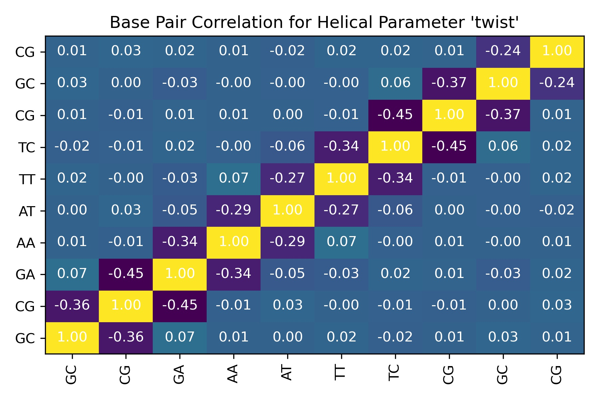
    


<a id="intrahpcorr"></a>
### Helical Parameter Correlations: Intra-base pair 


```python
from biobb_dna.intrabp_correlations.intrahpcorr import intrahpcorr

timeseries_shear = timeseries_dir+"/series_shear_"+timesel.value[:-1]+".csv"
timeseries_stretch = timeseries_dir+"/series_stretch_"+timesel.value[:-1]+".csv"
timeseries_stagger = timeseries_dir+"/series_stagger_"+timesel.value[:-1]+".csv"
timeseries_buckle = timeseries_dir+"/series_buckle_"+timesel.value[:-1]+".csv"
timeseries_propel = timeseries_dir+"/series_propel_"+timesel.value[:-1]+".csv"
timeseries_opening = timeseries_dir+"/series_opening_"+timesel.value[:-1]+".csv"

output_helpar_bp_correlation_csv_path = "helpar_bp_correlation.csv"
output_helpar_bp_correlation_jpg_path = "helpar_bp_correlation.jpg"

intrahpcorr(
    input_filename_shear=timeseries_shear,
    input_filename_stretch=timeseries_stretch,
    input_filename_stagger=timeseries_stagger,
    input_filename_buckle=timeseries_buckle,
    input_filename_propel=timeseries_propel,
    input_filename_opening=timeseries_opening,
    output_csv_path=output_helpar_bp_correlation_csv_path,
    output_jpg_path=output_helpar_bp_correlation_jpg_path)

```


```python
df = pd.read_csv(output_helpar_bp_correlation_csv_path)
df
```


<div>
<style scoped>
    .dataframe tbody tr th:only-of-type {
        vertical-align: middle;
    }

    .dataframe tbody tr th {
        vertical-align: top;
    }

    .dataframe thead th {
        text-align: right;
    }
</style>
<table border="1" class="dataframe">
  <thead>
    <tr style="text-align: right;">
      <th></th>
      <th>Unnamed: 0</th>
      <th>shear</th>
      <th>stretch</th>
      <th>stagger</th>
      <th>buckle</th>
      <th>propel</th>
      <th>opening</th>
    </tr>
  </thead>
  <tbody>
    <tr>
      <th>0</th>
      <td>shear</td>
      <td>1.000000</td>
      <td>-0.122310</td>
      <td>0.062783</td>
      <td>-0.024045</td>
      <td>0.012255</td>
      <td>0.066297</td>
    </tr>
    <tr>
      <th>1</th>
      <td>stretch</td>
      <td>-0.122310</td>
      <td>1.000000</td>
      <td>-0.024948</td>
      <td>-0.141840</td>
      <td>-0.034225</td>
      <td>0.396172</td>
    </tr>
    <tr>
      <th>2</th>
      <td>stagger</td>
      <td>0.062783</td>
      <td>-0.024948</td>
      <td>1.000000</td>
      <td>-0.172773</td>
      <td>-0.253086</td>
      <td>0.138571</td>
    </tr>
    <tr>
      <th>3</th>
      <td>buckle</td>
      <td>-0.024045</td>
      <td>-0.141840</td>
      <td>-0.172773</td>
      <td>1.000000</td>
      <td>0.029668</td>
      <td>0.000972</td>
    </tr>
    <tr>
      <th>4</th>
      <td>propel</td>
      <td>0.012255</td>
      <td>-0.034225</td>
      <td>-0.253086</td>
      <td>0.029668</td>
      <td>1.000000</td>
      <td>-0.138484</td>
    </tr>
    <tr>
      <th>5</th>
      <td>opening</td>
      <td>0.066297</td>
      <td>0.396172</td>
      <td>0.138571</td>
      <td>0.000972</td>
      <td>-0.138484</td>
      <td>1.000000</td>
    </tr>
  </tbody>
</table>
</div>


```python
Image(filename=output_helpar_bp_correlation_jpg_path,width = 600)
```


    
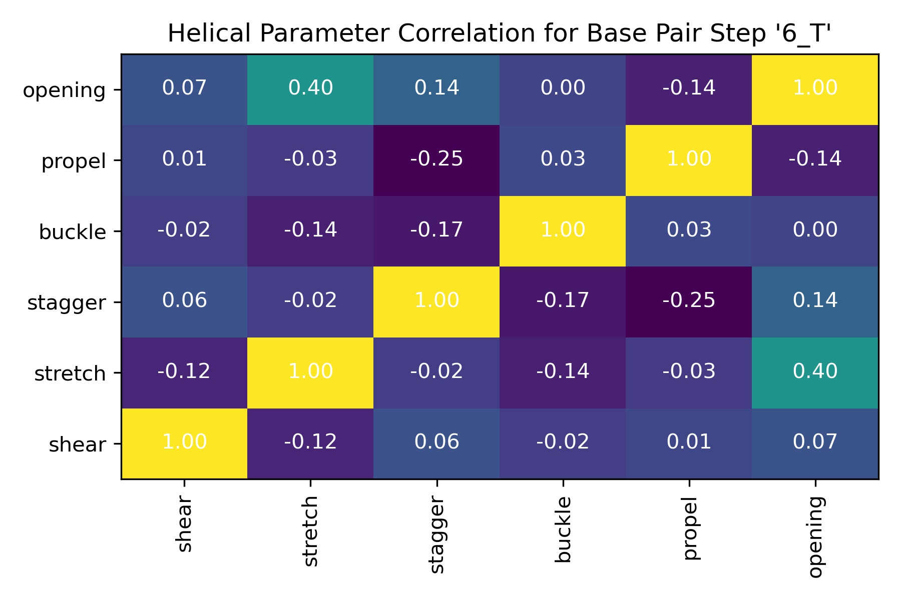
    


<a id="interhpcorr"></a>
### Helical Parameter Correlations: Inter-base pair steps


```python
from biobb_dna.interbp_correlations.interhpcorr import interhpcorr

timeseries_shift = timeseries_dir+"/series_shift_"+timesel.value+".csv"
timeseries_slide = timeseries_dir+"/series_slide_"+timesel.value+".csv"
timeseries_rise = timeseries_dir+"/series_rise_"+timesel.value+".csv"
timeseries_tilt = timeseries_dir+"/series_tilt_"+timesel.value+".csv"
timeseries_roll = timeseries_dir+"/series_roll_"+timesel.value+".csv"
timeseries_twist = timeseries_dir+"/series_twist_"+timesel.value+".csv"

output_helpar_bps_correlation_csv_path = "helpar_bps_correlation.csv"
output_helpar_bps_correlation_jpg_path = "helpar_bps_correlation.jpg"

interhpcorr(
    input_filename_shift=timeseries_shift,
    input_filename_slide=timeseries_slide,
    input_filename_rise=timeseries_rise,
    input_filename_tilt=timeseries_tilt,
    input_filename_roll=timeseries_roll,
    input_filename_twist=timeseries_twist,
    output_csv_path=output_helpar_bps_correlation_csv_path,
    output_jpg_path=output_helpar_bps_correlation_jpg_path)

```


```python
df = pd.read_csv(output_helpar_bps_correlation_csv_path)
df
```


<div>
<style scoped>
    .dataframe tbody tr th:only-of-type {
        vertical-align: middle;
    }

    .dataframe tbody tr th {
        vertical-align: top;
    }

    .dataframe thead th {
        text-align: right;
    }
</style>
<table border="1" class="dataframe">
  <thead>
    <tr style="text-align: right;">
      <th></th>
      <th>Unnamed: 0</th>
      <th>shift</th>
      <th>slide</th>
      <th>rise</th>
      <th>tilt</th>
      <th>roll</th>
      <th>twist</th>
    </tr>
  </thead>
  <tbody>
    <tr>
      <th>0</th>
      <td>shift</td>
      <td>1.000000</td>
      <td>0.439831</td>
      <td>0.006659</td>
      <td>0.166307</td>
      <td>0.113906</td>
      <td>0.318624</td>
    </tr>
    <tr>
      <th>1</th>
      <td>slide</td>
      <td>0.439831</td>
      <td>1.000000</td>
      <td>-0.207299</td>
      <td>0.151236</td>
      <td>0.141627</td>
      <td>0.541202</td>
    </tr>
    <tr>
      <th>2</th>
      <td>rise</td>
      <td>0.006659</td>
      <td>-0.207299</td>
      <td>1.000000</td>
      <td>-0.173336</td>
      <td>-0.224263</td>
      <td>0.147534</td>
    </tr>
    <tr>
      <th>3</th>
      <td>tilt</td>
      <td>0.166307</td>
      <td>0.151236</td>
      <td>-0.173336</td>
      <td>1.000000</td>
      <td>-0.032611</td>
      <td>0.084610</td>
    </tr>
    <tr>
      <th>4</th>
      <td>roll</td>
      <td>0.113906</td>
      <td>0.141627</td>
      <td>-0.224263</td>
      <td>-0.032611</td>
      <td>1.000000</td>
      <td>-0.109835</td>
    </tr>
    <tr>
      <th>5</th>
      <td>twist</td>
      <td>0.318624</td>
      <td>0.541202</td>
      <td>0.147534</td>
      <td>0.084610</td>
      <td>-0.109835</td>
      <td>1.000000</td>
    </tr>
  </tbody>
</table>
</div>


```python
Image(filename=output_helpar_bps_correlation_jpg_path,width = 600)
```


    
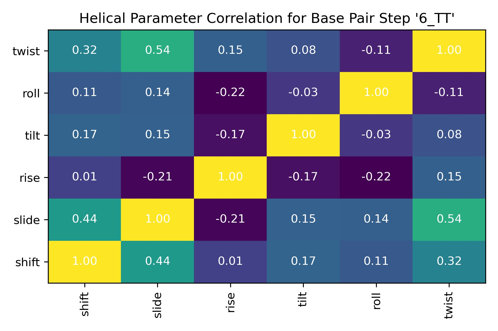
    


<a id="intrabpcorr"></a>
### Neighboring steps Correlations: Intra-base pair 


```python
from biobb_dna.intrabp_correlations.intrabpcorr import intrabpcorr

canal_shear = canal_dir+"/canal_output_shear.ser"
canal_stretch = canal_dir+"/canal_output_stretch.ser"
canal_stagger = canal_dir+"/canal_output_stagger.ser"
canal_buckle = canal_dir+"/canal_output_buckle.ser"
canal_propel = canal_dir+"/canal_output_propel.ser"
canal_opening = canal_dir+"/canal_output_opening.ser"

output_bp_correlation_csv_path = "bp_correlation.csv"
output_bp_correlation_jpg_path = "bp_correlation.jpg"

prop = {
    'sequence' : seq
}

intrabpcorr(
    input_filename_shear=canal_shear,
    input_filename_stretch=canal_stretch,
    input_filename_stagger=canal_stagger,
    input_filename_buckle=canal_buckle,
    input_filename_propel=canal_propel,
    input_filename_opening=canal_opening,
    output_csv_path=output_bp_correlation_csv_path,
    output_jpg_path=output_bp_correlation_jpg_path,
    properties=prop)
```


```python
df = pd.read_csv(output_bp_correlation_csv_path)
df
```


<div>
<style scoped>
    .dataframe tbody tr th:only-of-type {
        vertical-align: middle;
    }

    .dataframe tbody tr th {
        vertical-align: top;
    }

    .dataframe thead th {
        text-align: right;
    }
</style>
<table border="1" class="dataframe">
  <thead>
    <tr style="text-align: right;">
      <th></th>
      <th>Unnamed: 0</th>
      <th>shear/shear</th>
      <th>shear/stretch</th>
      <th>shear/stagger</th>
      <th>shear/buckle</th>
      <th>shear/propel</th>
      <th>shear/opening</th>
      <th>stretch/shear</th>
      <th>stretch/stretch</th>
      <th>stretch/stagger</th>
      <th>...</th>
      <th>propel/stagger</th>
      <th>propel/buckle</th>
      <th>propel/propel</th>
      <th>propel/opening</th>
      <th>opening/shear</th>
      <th>opening/stretch</th>
      <th>opening/stagger</th>
      <th>opening/buckle</th>
      <th>opening/propel</th>
      <th>opening/opening</th>
    </tr>
  </thead>
  <tbody>
    <tr>
      <th>0</th>
      <td>GC</td>
      <td>-0.005642</td>
      <td>0.018630</td>
      <td>-0.025087</td>
      <td>-0.010539</td>
      <td>0.024243</td>
      <td>0.019345</td>
      <td>-0.011061</td>
      <td>0.021519</td>
      <td>-0.020824</td>
      <td>...</td>
      <td>-0.024222</td>
      <td>0.005585</td>
      <td>0.006706</td>
      <td>-0.021960</td>
      <td>-0.010185</td>
      <td>0.006839</td>
      <td>-0.011742</td>
      <td>0.001443</td>
      <td>0.005266</td>
      <td>0.019129</td>
    </tr>
    <tr>
      <th>1</th>
      <td>CG</td>
      <td>0.020041</td>
      <td>0.051434</td>
      <td>0.001951</td>
      <td>-0.059043</td>
      <td>0.027216</td>
      <td>0.045336</td>
      <td>-0.051213</td>
      <td>-0.033895</td>
      <td>0.009731</td>
      <td>...</td>
      <td>0.047045</td>
      <td>-0.335039</td>
      <td>-0.122872</td>
      <td>-0.067494</td>
      <td>-0.047289</td>
      <td>-0.037659</td>
      <td>0.023410</td>
      <td>-0.105277</td>
      <td>-0.082899</td>
      <td>0.005289</td>
    </tr>
    <tr>
      <th>2</th>
      <td>GA</td>
      <td>-0.037801</td>
      <td>0.027801</td>
      <td>-0.015043</td>
      <td>-0.105601</td>
      <td>0.073992</td>
      <td>0.025790</td>
      <td>-0.010322</td>
      <td>0.043308</td>
      <td>0.011708</td>
      <td>...</td>
      <td>0.073619</td>
      <td>-0.176741</td>
      <td>-0.051962</td>
      <td>0.003138</td>
      <td>0.029520</td>
      <td>0.005160</td>
      <td>0.051622</td>
      <td>0.007026</td>
      <td>-0.017732</td>
      <td>0.021906</td>
    </tr>
    <tr>
      <th>3</th>
      <td>AA</td>
      <td>0.023788</td>
      <td>-0.000117</td>
      <td>-0.004595</td>
      <td>-0.027747</td>
      <td>-0.031901</td>
      <td>-0.041804</td>
      <td>0.023817</td>
      <td>-0.006556</td>
      <td>-0.005822</td>
      <td>...</td>
      <td>-0.061579</td>
      <td>-0.147203</td>
      <td>-0.004269</td>
      <td>-0.050649</td>
      <td>-0.039697</td>
      <td>0.035455</td>
      <td>-0.018540</td>
      <td>-0.093678</td>
      <td>-0.048917</td>
      <td>0.042879</td>
    </tr>
    <tr>
      <th>4</th>
      <td>AT</td>
      <td>0.032575</td>
      <td>0.003270</td>
      <td>-0.028156</td>
      <td>-0.070385</td>
      <td>-0.066959</td>
      <td>0.021602</td>
      <td>0.014530</td>
      <td>0.014772</td>
      <td>-0.047132</td>
      <td>...</td>
      <td>-0.113304</td>
      <td>-0.173226</td>
      <td>0.107649</td>
      <td>0.019869</td>
      <td>-0.036929</td>
      <td>-0.020634</td>
      <td>-0.030510</td>
      <td>0.021788</td>
      <td>0.036952</td>
      <td>0.119437</td>
    </tr>
    <tr>
      <th>5</th>
      <td>TT</td>
      <td>-0.010285</td>
      <td>-0.009504</td>
      <td>0.035414</td>
      <td>0.004137</td>
      <td>0.003110</td>
      <td>0.052842</td>
      <td>-0.020711</td>
      <td>0.005863</td>
      <td>-0.007229</td>
      <td>...</td>
      <td>-0.091332</td>
      <td>-0.132041</td>
      <td>0.183310</td>
      <td>0.023056</td>
      <td>-0.051025</td>
      <td>0.023035</td>
      <td>-0.017409</td>
      <td>0.003068</td>
      <td>0.010977</td>
      <td>0.191239</td>
    </tr>
    <tr>
      <th>6</th>
      <td>TC</td>
      <td>0.002390</td>
      <td>0.003433</td>
      <td>-0.024093</td>
      <td>0.014480</td>
      <td>-0.012981</td>
      <td>0.059420</td>
      <td>0.030606</td>
      <td>0.011428</td>
      <td>0.005235</td>
      <td>...</td>
      <td>-0.019650</td>
      <td>-0.152708</td>
      <td>0.080905</td>
      <td>0.021846</td>
      <td>-0.012044</td>
      <td>0.067861</td>
      <td>-0.083172</td>
      <td>0.048029</td>
      <td>0.028434</td>
      <td>0.151051</td>
    </tr>
    <tr>
      <th>7</th>
      <td>CG</td>
      <td>-0.027842</td>
      <td>0.002501</td>
      <td>0.014905</td>
      <td>0.010619</td>
      <td>0.018963</td>
      <td>0.030263</td>
      <td>-0.020690</td>
      <td>0.016758</td>
      <td>0.033150</td>
      <td>...</td>
      <td>0.063238</td>
      <td>-0.222382</td>
      <td>0.012536</td>
      <td>-0.021479</td>
      <td>-0.042303</td>
      <td>0.020077</td>
      <td>0.014984</td>
      <td>-0.018558</td>
      <td>-0.076957</td>
      <td>0.006822</td>
    </tr>
    <tr>
      <th>8</th>
      <td>GC</td>
      <td>-0.030918</td>
      <td>0.025377</td>
      <td>0.047997</td>
      <td>-0.149693</td>
      <td>0.032799</td>
      <td>0.004369</td>
      <td>-0.029652</td>
      <td>0.018781</td>
      <td>0.037963</td>
      <td>...</td>
      <td>0.063868</td>
      <td>-0.188492</td>
      <td>-0.044925</td>
      <td>-0.027264</td>
      <td>-0.025809</td>
      <td>0.027768</td>
      <td>0.030092</td>
      <td>-0.062296</td>
      <td>0.025229</td>
      <td>0.019334</td>
    </tr>
    <tr>
      <th>9</th>
      <td>CG</td>
      <td>-0.001727</td>
      <td>0.039837</td>
      <td>0.013472</td>
      <td>-0.031293</td>
      <td>-0.014562</td>
      <td>0.043469</td>
      <td>-0.018693</td>
      <td>-0.008573</td>
      <td>0.026310</td>
      <td>...</td>
      <td>0.044891</td>
      <td>-0.303367</td>
      <td>-0.113362</td>
      <td>-0.080200</td>
      <td>-0.018591</td>
      <td>-0.029267</td>
      <td>0.032287</td>
      <td>-0.095808</td>
      <td>-0.074735</td>
      <td>-0.005167</td>
    </tr>
  </tbody>
</table>
<p>10 rows × 37 columns</p>
</div>


```python
Image(filename=output_bp_correlation_jpg_path,width = 800)
```


    
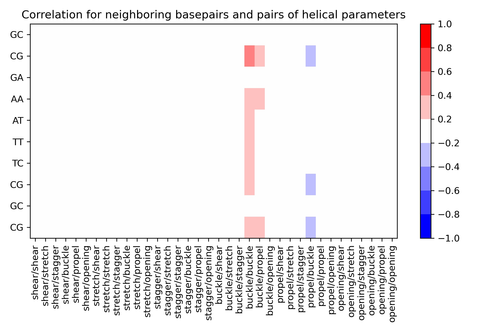
    


<a id="interbpcorr"></a>
### Neighboring steps Correlations: Inter-base pair steps


```python
from biobb_dna.interbp_correlations.interbpcorr import interbpcorr

canal_shift = canal_dir+"/canal_output_shift.ser"
canal_slide = canal_dir+"/canal_output_slide.ser"
canal_rise = canal_dir+"/canal_output_rise.ser"
canal_tilt = canal_dir+"/canal_output_tilt.ser"
canal_roll = canal_dir+"/canal_output_roll.ser"
canal_twist = canal_dir+"/canal_output_twist.ser"

output_bps_correlation_csv_path = "bps_correlation.csv"
output_bps_correlation_jpg_path = "bps_correlation.jpg"

prop = {
    'sequence' : seq
}

interbpcorr(
    input_filename_shift=canal_shift,
    input_filename_slide=canal_slide,
    input_filename_rise=canal_rise,
    input_filename_tilt=canal_tilt,
    input_filename_roll=canal_roll,
    input_filename_twist=canal_twist,
    output_csv_path=output_bps_correlation_csv_path,
    output_jpg_path=output_bps_correlation_jpg_path,
    properties=prop)
```


```python
df = pd.read_csv(output_bps_correlation_csv_path)
df
```


<div>
<style scoped>
    .dataframe tbody tr th:only-of-type {
        vertical-align: middle;
    }

    .dataframe tbody tr th {
        vertical-align: top;
    }

    .dataframe thead th {
        text-align: right;
    }
</style>
<table border="1" class="dataframe">
  <thead>
    <tr style="text-align: right;">
      <th></th>
      <th>Unnamed: 0</th>
      <th>shift/shift</th>
      <th>shift/slide</th>
      <th>shift/rise</th>
      <th>shift/tilt</th>
      <th>shift/roll</th>
      <th>shift/twist</th>
      <th>slide/shift</th>
      <th>slide/slide</th>
      <th>slide/rise</th>
      <th>...</th>
      <th>roll/rise</th>
      <th>roll/tilt</th>
      <th>roll/roll</th>
      <th>roll/twist</th>
      <th>twist/shift</th>
      <th>twist/slide</th>
      <th>twist/rise</th>
      <th>twist/tilt</th>
      <th>twist/roll</th>
      <th>twist/twist</th>
    </tr>
  </thead>
  <tbody>
    <tr>
      <th>0</th>
      <td>GCG</td>
      <td>-0.034515</td>
      <td>-0.013978</td>
      <td>0.028504</td>
      <td>-0.016774</td>
      <td>0.007526</td>
      <td>-0.019706</td>
      <td>-0.005945</td>
      <td>0.003258</td>
      <td>0.016998</td>
      <td>...</td>
      <td>-0.024289</td>
      <td>0.034074</td>
      <td>-0.014922</td>
      <td>0.002918</td>
      <td>0.024087</td>
      <td>0.011902</td>
      <td>-0.018600</td>
      <td>-0.000658</td>
      <td>0.004749</td>
      <td>0.031633</td>
    </tr>
    <tr>
      <th>1</th>
      <td>CGA</td>
      <td>-0.620729</td>
      <td>-0.213534</td>
      <td>0.153552</td>
      <td>-0.379811</td>
      <td>-0.069482</td>
      <td>0.090324</td>
      <td>-0.185796</td>
      <td>0.035204</td>
      <td>-0.072609</td>
      <td>...</td>
      <td>0.185182</td>
      <td>0.239957</td>
      <td>-0.327237</td>
      <td>0.146238</td>
      <td>-0.301986</td>
      <td>-0.066687</td>
      <td>-0.230273</td>
      <td>-0.149935</td>
      <td>0.234940</td>
      <td>-0.358276</td>
    </tr>
    <tr>
      <th>2</th>
      <td>GAA</td>
      <td>-0.556258</td>
      <td>-0.055634</td>
      <td>0.106571</td>
      <td>-0.307558</td>
      <td>-0.124963</td>
      <td>0.111320</td>
      <td>0.336513</td>
      <td>0.207062</td>
      <td>0.010327</td>
      <td>...</td>
      <td>0.243220</td>
      <td>0.222142</td>
      <td>-0.356105</td>
      <td>0.262547</td>
      <td>-0.112359</td>
      <td>-0.169531</td>
      <td>-0.267369</td>
      <td>-0.017553</td>
      <td>0.222109</td>
      <td>-0.448559</td>
    </tr>
    <tr>
      <th>3</th>
      <td>AAT</td>
      <td>-0.422776</td>
      <td>0.121578</td>
      <td>0.172917</td>
      <td>-0.120018</td>
      <td>-0.234489</td>
      <td>0.333776</td>
      <td>0.200294</td>
      <td>0.055308</td>
      <td>-0.062561</td>
      <td>...</td>
      <td>0.182963</td>
      <td>0.269344</td>
      <td>-0.261031</td>
      <td>0.037170</td>
      <td>-0.055827</td>
      <td>-0.035366</td>
      <td>-0.125160</td>
      <td>-0.008524</td>
      <td>0.080896</td>
      <td>-0.336058</td>
    </tr>
    <tr>
      <th>4</th>
      <td>ATT</td>
      <td>-0.135159</td>
      <td>0.048764</td>
      <td>0.052558</td>
      <td>0.152407</td>
      <td>-0.137398</td>
      <td>0.093877</td>
      <td>-0.058611</td>
      <td>0.177430</td>
      <td>0.140074</td>
      <td>...</td>
      <td>0.189502</td>
      <td>0.241552</td>
      <td>-0.262516</td>
      <td>0.016017</td>
      <td>-0.027548</td>
      <td>-0.024130</td>
      <td>-0.059852</td>
      <td>-0.003261</td>
      <td>0.031997</td>
      <td>-0.293106</td>
    </tr>
    <tr>
      <th>5</th>
      <td>TTC</td>
      <td>-0.115228</td>
      <td>0.074008</td>
      <td>0.011805</td>
      <td>0.204128</td>
      <td>-0.216200</td>
      <td>-0.032101</td>
      <td>-0.028032</td>
      <td>0.184504</td>
      <td>0.114301</td>
      <td>...</td>
      <td>0.113645</td>
      <td>0.247625</td>
      <td>-0.299766</td>
      <td>-0.015864</td>
      <td>-0.148998</td>
      <td>0.111239</td>
      <td>0.075143</td>
      <td>0.053240</td>
      <td>-0.015885</td>
      <td>-0.273020</td>
    </tr>
    <tr>
      <th>6</th>
      <td>TCG</td>
      <td>-0.428290</td>
      <td>-0.230813</td>
      <td>0.116441</td>
      <td>0.057122</td>
      <td>-0.208447</td>
      <td>-0.118440</td>
      <td>-0.121029</td>
      <td>0.055468</td>
      <td>0.090725</td>
      <td>...</td>
      <td>0.093449</td>
      <td>0.287541</td>
      <td>-0.273905</td>
      <td>0.101453</td>
      <td>-0.316904</td>
      <td>-0.253028</td>
      <td>-0.076103</td>
      <td>-0.114819</td>
      <td>0.066582</td>
      <td>-0.335519</td>
    </tr>
    <tr>
      <th>7</th>
      <td>CGC</td>
      <td>-0.577276</td>
      <td>-0.389311</td>
      <td>0.286179</td>
      <td>-0.324285</td>
      <td>-0.179625</td>
      <td>0.071846</td>
      <td>0.054698</td>
      <td>0.233093</td>
      <td>-0.148480</td>
      <td>...</td>
      <td>0.140274</td>
      <td>0.210203</td>
      <td>-0.362062</td>
      <td>0.244422</td>
      <td>-0.150061</td>
      <td>-0.097582</td>
      <td>-0.265051</td>
      <td>-0.021533</td>
      <td>0.240612</td>
      <td>-0.447802</td>
    </tr>
    <tr>
      <th>8</th>
      <td>GCG</td>
      <td>-0.626682</td>
      <td>0.229957</td>
      <td>0.290226</td>
      <td>-0.338901</td>
      <td>-0.240202</td>
      <td>0.328321</td>
      <td>0.213949</td>
      <td>0.040634</td>
      <td>0.007077</td>
      <td>...</td>
      <td>0.287660</td>
      <td>0.196857</td>
      <td>-0.327687</td>
      <td>0.263437</td>
      <td>-0.127565</td>
      <td>-0.149207</td>
      <td>-0.200700</td>
      <td>-0.092674</td>
      <td>0.171328</td>
      <td>-0.372676</td>
    </tr>
  </tbody>
</table>
<p>9 rows × 37 columns</p>
</div>


```python
Image(filename=output_bps_correlation_jpg_path,width = 800)
```


    
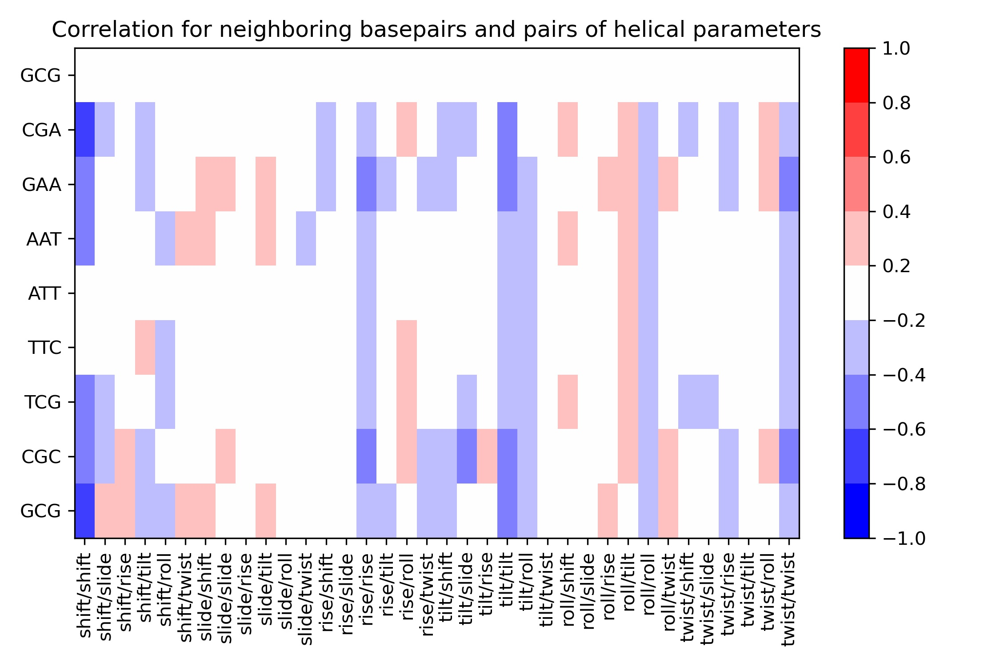
    


***
<a id="questions"></a>

## Questions & Comments

Questions, issues, suggestions and comments are really welcome!

* GitHub issues:
    * [https://github.com/bioexcel/biobb](https://github.com/bioexcel/biobb)

* BioExcel forum:
    * [https://ask.bioexcel.eu/c/BioExcel-Building-Blocks-library](https://ask.bioexcel.eu/c/BioExcel-Building-Blocks-library)

